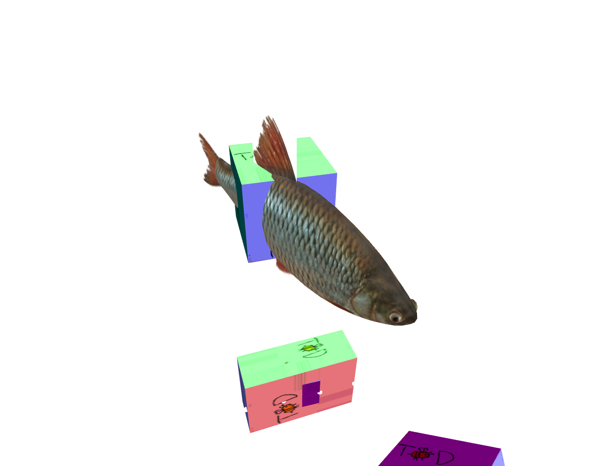

# Week 2 Report

  <figure>
    
    <figcaption>
      8 little guys
    </figcaption>
  </figure>
  <figure>
    
    <figcaption>
      A: a classic abandoned fort/castle aesthetic, pretty generic but it does fit the silly party game aesthetic were going for the best bc its an aesthetic everyone knows well and are comfortable seeing
    </figcaption>
  </figure>
  <figure>
    
    <figcaption>
      B: a more dark and spooky underground dungeon vibe, this leans more towards the horror aspect since all the walls and floors are dark, making even lit up rooms still seem dark and eerie
    </figcaption>
  </figure>
  <figure>
    
    <figcaption>
      C: also another abandoned fort/castle/temple aesthetic, this time with more nature elements infesting the place, this would make room to make the boss more plant/earth themed but also makes the game seems more serious? (in my opinion at least since the whole human vs. environment thing could be read into many diff ways)
    </figcaption>
  </figure>
  <figure>
    
    <figcaption>
      D: a more high fantasy theme, with bright colorful walls and decorations, could might look too magical for a game thats about crafting more mundane tools, but maybe it would be cool?
    </figcaption>
  </figure>
  <figure>
    
    <figcaption>
      the boss could be some sort of mushroom king and the little minion is a tiny little mushroom minion who managed through slip through the cracks of the rock barrier and messes w the players as the mushroom king is breaking down the barrier
    </figcaption>
  </figure>
  <figure>
    
    <figcaption>
      proposal: the game shall be called "Wrong Cave!"
    </figcaption>
  </figure>

  <figure>
    <video src="../../images/dev/first-wireframe.mp4" controls preload="none" poster="../../images/dev/first-wireframe-poster.png"></video>
    <figcaption>
      the camera is moving on the client side, and all the boxes are being moved on the server side. the server only moves everything at 25 fps which is why it looks choppy
    </figcaption>
  </figure>
  <figure>
    <video src="../../images/dev/plane-wireframe.mp4" controls preload="none" poster="../../images/dev/plane-wireframe-poster.png"></video>
    <figcaption>
      okay networking team, it draws your colliders now. there's also support for flat squares if you want to add floors and stuff
    </figcaption>
  </figure>
  <figure>
    
    <figcaption>
      Y'ALL. THE FISH IS REAL
    </figcaption>
  </figure>

## Group status

<!-- include both the week # and the date of the meeting -->

Meeting: Day, Month Date, 2024

<!-- summarize your overall status for the week -->

<!-- add a statement summarizing the group morale (feel free to be creative in expressing your morale) -->

## Individual statuses

1. what were your concrete goals for the week?
1. what goals were you able to accomplish?
1. if the week went differently than you had planned, what were the reasons? note that this happens regularly...I would prefer you to be aggressive in what you want to try accomplish rather than limit yourself to goals you know you’ll easily achieve. so answering this question is more of a reflection on the development process and the surprises you encounter, it’s not at all an evaluation.
1. what are your specific goals for the next week?
1. what did you learn this week, if anything (and did you expect to learn it?)
1. what is your individual morale (which might be different from the overall group morale)?

### Nick

### Marcelo

### Tyler

### Killian

### Sean

My goals for this week were to get the moving cube done because I felt that we are able to do it fairly quickly. Since we depended on the networking team to figure out the best format to send the game state in, a lot of our work is blocked by them. Therefore, as a secondary goal, I could alternatively work on parsing Blender models to prepare for whenever Killian is ready with them.

Fortunately, Nick added a physics engine on the server and sent the collision boxes to the client, so I worked on drawing wireframes for the collsion boxes. I then spent the weekend reading the glTF specification and implementing a parser.

Reading the glTF spec was pretty helpful because it offered one way to structure our game's objects. I initially was going to have a server-synched `Entity` class that has a list of collision boxes for the server-side physics engine and a list of meshes to draw on the client. Each mesh would have a geometry (vertex data) and material (shaders) that would be defined independently, so we can swap out materials for the same geometry, and vice versa. I modelled this after three.js.

However, it turned out that our geometry was very closely associated with the shader it was meant for because different shaders require different attributes. I realized that a better structure would have `Material` be a property of `Geometry`, rather than having them as independent siblings.

In glTF, objects are represented as a tree hierarchy of nodes, which represent transformations that also apply to its children. Each node can have an associated mesh, which defines the attribute values (e.g. vertex positions and normals), as well as a material. I think our game state might end up being represented similar to this.

Ultimately, implementing a glTF parser myself taught me how 3D programs represent 3D models, and it made me more confident in using WebGL objects, like understanding the difference between vertex array objects and buffers.

My current morale is very motivated; it helps that my other classes are currently very light. I did more this week than I expected, but I worry that if I'm the only person who wrote the graphics code so far, it'll be hard for others to catch up. Reading other people's code is hard, and this is particularly the case for graphics code. Also, I think I should clean up the code (restructuring files, documenting code) before I work on anything else.

Therefore, my goals for next week are to clean up the client codebase and explain how my changes work to the rest of the team.

For the entire graphics team, I think our next steps are to add lighting to our glTF models. But we should also decide as a group how we want the game to look because realistic lighting won't be great for a cartoonish look, and if our game takes place in darkness we may want to more carefully consider how we implement lighting.

### Will

### Kenzo
