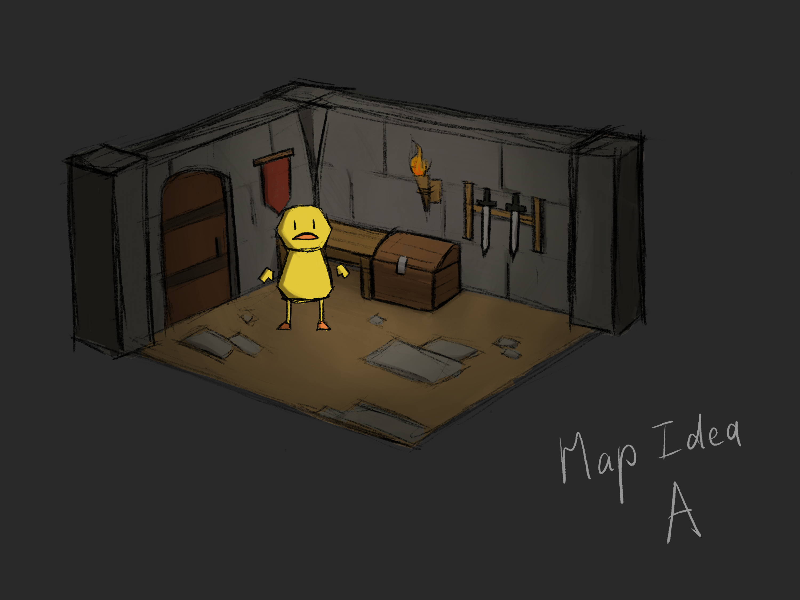
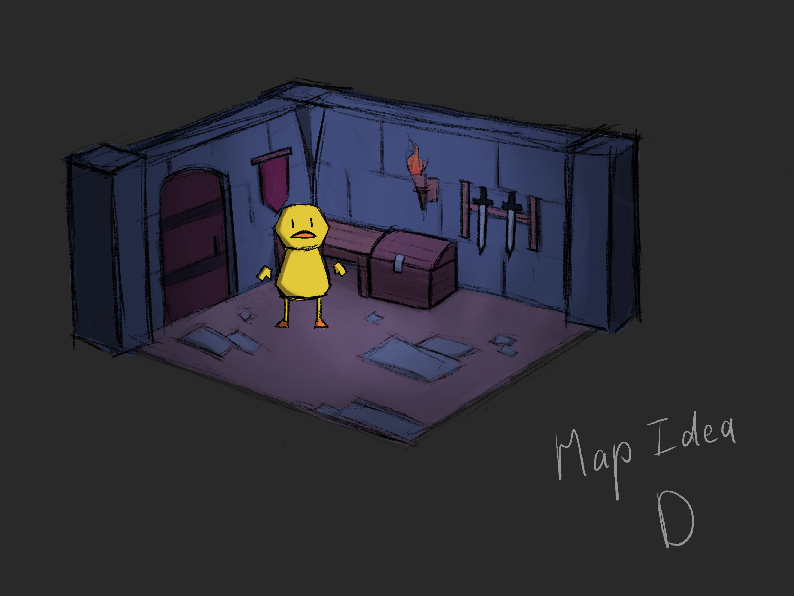
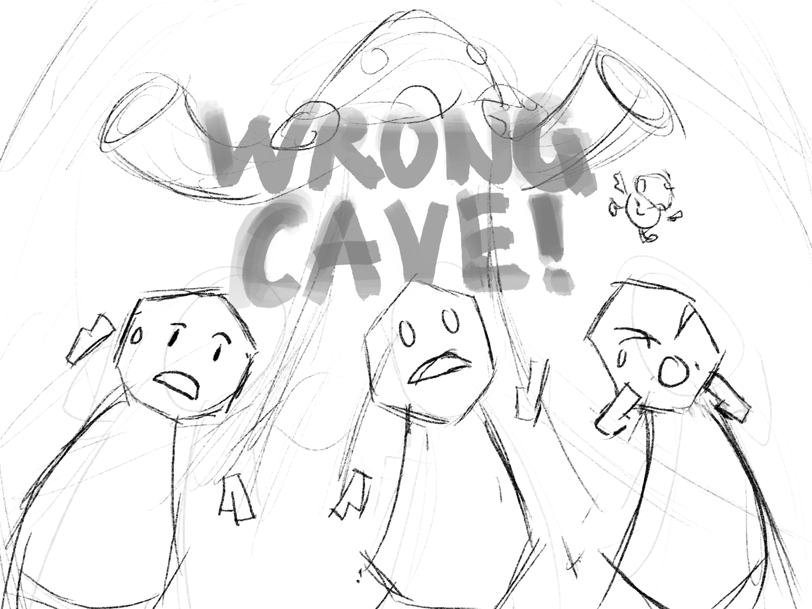

# Week 2 Report

  <figure>
    
    <figcaption>
      8 little guys
    </figcaption>
  </figure>
  <figure>
    
    <figcaption>
      A: a classic abandoned fort/castle aesthetic, pretty generic but it does fit the silly party game aesthetic were going for the best bc its an aesthetic everyone knows well and are comfortable seeing
    </figcaption>
  </figure>
  <figure>
    
    <figcaption>
      B: a more dark and spooky underground dungeon vibe, this leans more towards the horror aspect since all the walls and floors are dark, making even lit up rooms still seem dark and eerie
    </figcaption>
  </figure>
  <figure>
    
    <figcaption>
      C: also another abandoned fort/castle/temple aesthetic, this time with more nature elements infesting the place, this would make room to make the boss more plant/earth themed but also makes the game seems more serious? (in my opinion at least since the whole human vs. environment thing could be read into many diff ways)
    </figcaption>
  </figure>
  <figure>
    
    <figcaption>
      D: a more high fantasy theme, with bright colorful walls and decorations, could might look too magical for a game thats about crafting more mundane tools, but maybe it would be cool?
    </figcaption>
  </figure>
  <figure>
    
    <figcaption>
      the boss could be some sort of mushroom king and the little minion is a tiny little mushroom minion who managed through slip through the cracks of the rock barrier and messes w the players as the mushroom king is breaking down the barrier
    </figcaption>
  </figure>
  <figure>
    
    <figcaption>
      proposal: the game shall be called "Wrong Cave!"
    </figcaption>
  </figure>

  <figure>
    <video src="../../images/dev/first-wireframe.mp4" controls preload="none" poster="../../images/dev/first-wireframe-poster.png"></video>
    <figcaption>
      the camera is moving on the client side, and all the boxes are being moved on the server side. the server only moves everything at 25 fps which is why it looks choppy
    </figcaption>
  </figure>
  <figure>
    <video src="../../images/dev/plane-wireframe.mp4" controls preload="none" poster="../../images/dev/plane-wireframe-poster.png"></video>
    <figcaption>
      okay networking team, it draws your colliders now. there's also support for flat squares if you want to add floors and stuff
    </figcaption>
  </figure>
  <figure>
    
    <figcaption>
      Y'ALL. THE FISH IS REAL
    </figcaption>
  </figure>

## Group status

<!-- include both the week # and the date of the meeting -->

Meeting: [Sunday, April 14, 2024](#meeting-notes)

<!-- summarize your overall status for the week -->

Towards our MVP, our game engine can now render Blender models and draw outlines of collision boxes. With a physics engine (cannon.js) powering game simulation on the server, objects can now collide with the environment and each other. Overall, we'd consider ourselves ahead of schedule.

Our main priorities, broken down by team, are:

- Networking & game logic
  - Handle client input: This will likely take the form of pushing a box around whenever a user presses the _w_ key.
  - Implement `Entity`s towards structuring how our game stores the game state.
  - Look into converting from quaternions to Euler angles.
  - Research how to export hitboxes created in Blender.
- Graphics
  - Implement shading, probably using toon shading (aka cel shading).
  - Investigate performance impact of having a lot of point lights.
  - Fix model rendering on devices with low vertex limits. (low priority)

We've also devised a new timeline that takes into account our progress and proposed new game logic system, codenamed George.

- Week 3: Structuring (implementing the `Entity` class).
- Week 4: Create a temporary testing map and set up the beginnings of George.
- Week 5: _Breathing room for midterms._
- Week 6: Finish our game logic (George).
- Week 7: Implement sabotage (iffy).
- Weeks 8 and after: Testing and tuning.

<!-- add a statement summarizing the group morale (feel free to be creative in expressing your morale) -->

Our group morale is like a hungry mushroom monster ready to pounce and feast on a pack of puny miners entering a cave.

## Individual statuses

1. what were your concrete goals for the week?
1. what goals were you able to accomplish?
1. if the week went differently than you had planned, what were the reasons? note that this happens regularly...I would prefer you to be aggressive in what you want to try accomplish rather than limit yourself to goals you know you'll easily achieve. so answering this question is more of a reflection on the development process and the surprises you encounter, it's not at all an evaluation.
1. what are your specific goals for the next week?
1. what did you learn this week, if anything (and did you expect to learn it?)
1. what is your individual morale (which might be different from the overall group morale)?

### Nick

### Marcelo

### Tyler

1. what were your concrete goals for the week?

   My concrete goals for the week were to:

   1. Learning Typescript enough to understand the codebase
   2. Understand how the client interacts with the server on a deeper level
   3. Meet with Nick and other Networking team members so that we could pair program about how things actually work for my benefit
   4. Learn webGL enough to understand the codebase

2. what goals were you able to accomplish?

   Actually, I nailed all of my goals!

   My goals themselves are a little strange: I didn't plan that I would be solidly able to expand on the codebase at all, which is unfortunately just a given side-effect of not knowing javascript, typescript, or anything about networking. That being said, I think I planned for it quite well in my head, as I'm now fairly up to date on the codebase with my environment fully set up, and while pair programming I can actually help set up new features and structuring ideas.

3. if the week went differently than you had planned, what were the
   reasons? note that this happens regularly...I would prefer you to
   be aggressive in what you want to try accomplish rather than limit
   yourself to goals you know you'll easily achieve. so answering
   this question is more of a reflection on the development process
   and the surprises you encounter, it's not at all an evaluation.

   Oh yeah, I had a huge amount of work come in from VGDC and other classes that I wasn't expecting at all. We just hit VGDC officer interviews after starting our longer game jam, so I've been busy running around in meetings getting my ideas across and understanding what is needed of me.

   This meant that the weekend, where I was expecting to be able to get through the most development, was completely booked, meaning I both couldn't do any development for the project as well as rest for the next week.

   I'm more than a little worried that the lack of true rest that I got will sap my energy for the upcoming week, resulting in even less work, but I'm going to be trying to rest more and push forward with the project as much as I can.

4. what are your specific goals for the next week?

   1. Meet with Nick and the Networking team about the restructuring we talked about in the weekly meeting
   2. Create the capsule collider and successfully lock it's y axis with Nick
   3. Create the Entity interface, and possibly create a few Entity implementations that we can test with and work on
   4. Talk with Marcello

5. what did you learn this week, if anything (and did you expect to learn it?)

   I learned quite a bit about typescript and how it works, and I learned that sometimes, being the first person to suggest a meeting will get everyone interested, even if it's not related to them.

   The first non-weekly meeting that we had was supposed to be a pair programming session with Nick, but we ended up with solidly 6/7 members of the group going, to various degrees of success, but having everyone show up in that capacity was a surprise.

6. what is your individual morale (which might be different from the
   overall group morale)?

   Uhhhhh.

   My individual morale is a bit lower than I think the rest of the group's morale is, but that's partially because I've been so overworked in the past couple days. I also have some insider knowledge into the fact that, because I don't know Typescript and am having the learn the language in such a hands on way, that my effect on the team is going to be significantly less than what I would both like it to be and what I think is expected of me.

   I think that I'm the least learned member of the group regarding knowledge and skill in programming, and I've got to make up for it in passion and effort, and man am I tired.

### Killian

1. My concrete goals this week were to create concept art for the game, decide on a specific aesthetic and storyline that would drive the look of the game, finish more Blender tutorials, and also help with game design.

2. This week I was able to make concept art for the characters in the game, mock up different looks for the environment to get feedback from the team and decide on one that we'd like to move forward with, solidify a storyline that's going to help drive the art direction and game design, sketch ideas for the boss and minion units, and ideate on some interesting gameplay mechanics.

3. For this week, I definitely did not go through as many Blender tutorials as I wanted to with other classes and commitments in the way. Which is something I would want to focus on next week.

4. Next week is a rather hectic week for me, but I would still want to complete all the concept arts needed for the game so when I create the 3D models, I have an accurate and reliable reference to use. I also want to focus on completing as much Blender tutorials as I can so I can be fully prepared to transfer my 2D work into 3D.

5. This week, I learned more about Blender modeling with the tutorials I did get to complete, and also more about making environmental concept art, something I haven't done much in the past.

6. I am excited to see this game be made, but am nervous about my own ability to make a lot of 3D assets for the game since I'm relatively new at 3D modeling.

### Sean

My goals for this week were to get the moving cube done because I felt that we are able to do it fairly quickly. Since we depended on the networking team to figure out the best format to send the game state in, a lot of our work is blocked by them. Therefore, as a secondary goal, I could alternatively work on parsing Blender models to prepare for whenever Killian is ready with them.

Fortunately, Nick added a physics engine on the server and sent the collision boxes to the client, so I worked on drawing wireframes for the collsion boxes. I then spent the weekend reading the glTF specification and implementing a parser.

Reading the glTF spec was pretty helpful because it offered one way to structure our game's objects. I initially was going to have a server-synched `Entity` class that has a list of collision boxes for the server-side physics engine and a list of meshes to draw on the client. Each mesh would have a geometry (vertex data) and material (shaders) that would be defined independently, so we can swap out materials for the same geometry, and vice versa. I modelled this after three.js.

However, it turned out that our geometry was very closely associated with the shader it was meant for because different shaders require different attributes. I realized that a better structure would have `Material` be a property of `Geometry`, rather than having them as independent siblings.

In glTF, objects are represented as a tree hierarchy of nodes, which represent transformations that also apply to its children. Each node can have an associated mesh, which defines the attribute values (e.g. vertex positions and normals), as well as a material. I think our game state might end up being represented similar to this.

Ultimately, implementing a glTF parser myself taught me how 3D programs represent 3D models, and it made me more confident in using WebGL objects, like understanding the difference between vertex array objects and buffers.

My current morale is very motivated; it helps that my other classes are currently very light. I did more this week than I expected, but I worry that if I'm the only person who wrote the graphics code so far, it'll be hard for others to catch up. Reading other people's code is hard, and this is particularly the case for graphics code. Also, I think I should clean up the code (restructuring files, documenting code) before I work on anything else.

Therefore, my goals for next week are to clean up the client codebase and explain how my changes work to the rest of the team.

For the entire graphics team, I think our next steps are to add lighting to our glTF models. But we should also decide as a group how we want the game to look because realistic lighting won't be great for a cartoonish look, and if our game takes place in darkness we may want to more carefully consider how we implement lighting.

### Will

1. My goal for the past week was to get a basic 3D box and camera setup running in WebGL. Part of this was also to learn a mapping of OpenGL concepts to WebGL, since I've used OpenGL in C++ a lot but never used WebGL.

2. I was able to accomplish that goal: I created GameEngine, Camera, and Box classes and a simple shader program and got them to render client-side. It's unlikely that we'll keep this code around at least in its current state, besides maybe the Camera.

3. I got the box to show up on the screen pretty quickly, since the logic for that is very similar to OpenGL. But I spent a while getting it to show up with the correct size and aspect ratio, because with WebGL there's an additional layer of complexity with the `<canvas>` element which kind of has multiple notions of "size". I think this is a pretty common issue in web development, but now that it's (hopefully) been ironed out we can focus on the actual game from now on.

4. Sean and Nick made crazy progress after I got the basic setup working, but there seemed to be client-side issues on Kenzo's Mac. I also have a Mac so I'll see if I can fix them. I also want to write some more shaders so we can test the limits of things like dynamic point lighting, because that will determine what kinds of aesthetics are possible. Finally, another goal for our graphics team overall is mouse-controlled camera movement, so I'll work on that if I have time and someone else doesn't get to it first.

5. I learned that the WebGL workflow is pretty much the same as OpenGL's (create buffers, populate them, point to them, send them + uniforms to GPU, draw). One difference was that WebGL 1 somehow didn't support vertex arrays, but they were added in WebGL 2 so we're using that.

6. I'm excited that we have a solid-looking foundation to keep building on and our team has been good about sharing ideas openly and coming to a consensus. We seem to be ahead of schedule on the first big milestone, so I hope we can maintain this momentum.

### Kenzo

My concrete goals for the week is to learn the fundamentals for WebGL so that I can contribute to the graphics portion of the game. I was able to finish learning the fundamentals for WebGL, and try to understand part of our graphics code.I was hoping that I can contribute a lot to the graphics part of the game, however, due to my lack of experience in graphics I was not able to understand a lot of the code that are on the GitHub, so my plan is to meet more often with my group members so I can learn from them and getting guidance so that I can contribute more to the code in future weeks. My goals for next week are to learn how to use Blender and try making programmer art so that we can try the graphics engine and putting the art into the game and also to fix the toon shaders so it can work properly. This week, I learned the basics of WebGL, how does the shaders work (fragment and vertex shaders), how to set them up, how to draw triangles, how to use the buffer, how to draw rectangles using 2 triangles. My individual morale is to learn as much as possible from this project as I am very new to the graphics field.

## Meeting notes

Present: Sean, Kenzo, Tyler, Nick, Will

Excused: Killian

  <figure>
    
    <figcaption>
      An illustration of an <code>Entity</code>, things we've implemented, our to-do list for this week, aspects of game design to decide on, and topics to research.
    </figcaption>
  </figure>
  <figure>
    
    <figcaption>
      Our old and new timeline, a flow diagram of George as the intermediary, and how cannon.js works.
    </figcaption>
  </figure>

- (Tyler) Timeline updates
  - old timeline:
    - server exist, end of week 3
    - white box (no models, just temp models) and physics, end of week 6
    - game magic and collision, end of week 8
  - it's end of week 2
  - finished:
    - basic collision
    - server
    - ability to use blender model
      - texture mapping
    - almost but not quite critical milestone
  - todo:
    - **client input**
      - probably not that hard™️ - tyler
        - stop everything else, work on that
      - server currently receives input, doesnt do anything with it
      - you're probably doing it right now
      - Nick is in fact doing it right now
    - argument over downloading model from blender
      - tyler: server doesn't send model
      - nick: client downloads model over http
      - funny names for mesh IDs
      - server need to tell client to load model. then client can do whatever it currently is doing
      - nick suggestion: game model class, link model
      - "your head is in the right place" - nick
    - nick: capsule collider is important
      - sphere on top and bottom of cylinder
      - cannon doesn't have it by default, but can easily make it
      - rotation locked on vertical axis
    - tyler: we want the entity class
      - model
        - sean: can be null. like hit area for putting items in
        - nick: could be url
        - sean: name of model, eg funny name
          - name easier to read, unlike numerical IDs
        - anchor point, rotation + position
          - rotation is quaternion
          - nick: may need to use euler angles bc easier to deal with
          - sean: can use gl-matrix
          - tyler: euler axis order?
            - sean: YXZ
            - tyler: pitch, roll, yaw
          - nick: needed to apply quaternion rotation to make Y vertical. cannon seems to prefer an order
          - sean: cannon doesn't care what order it is
          - **^ to be researched**
  - server exists is DONE
  - critical milestone can be done within a week, tbh probably right now
    - we can say that it is done
  - physics is kind of done
    - sean: we're using a library. it _is_ done
  - collision: already done
    - comes with physics engine
    - nick: may need to tune collisions to see if it matches how we feel. requires testing
  - back to structuring (`Entity`)
    - `Entity`
      - `Model` (can be null)
      - `Anchor` (`vec)
    - what if an object doesn't have a hitbox?
      - sean: the skybox, the boss. anchored at the origin
      - nick: those should not be entities (but will have model) because no hitbox
        - so another superclass
      - nick: collider vs body
        - body can be for everything in the game
        - not every body has a collider
        - `Body` -> `Collider`
    - entities without model
      - sean: entities with multiple models
        - wall entity could have multiple torch models as well as the base wall model, and the same torch model could be held in the player's hand
        - `Entity` should have list of models, not just one
    - (aside) tree hierarchy
      - tyler: blender, unity does this
      - sean: makes things a bit complicated. would be nice if the server flattened it
    - `Entity` is the `Body`, and `Collider` is a subclass
- (Nick) more entity structure
  - server and client will have different entities. can make a superclass
  - `class Entity`
    - has array of models
    - `class Sphere extends Entity`
      - thinking about physics interfacing and creating a game, every `Entity` (eg a `Box`) has different properties
    - vec 3 position, rotation
    - velocity/momentum/force
      - not specified when creating
    - cannon has locking axes (useful for players)
    - when you create an entity, the object will be constructed from a class we create (JS obj with diff fields, specifying model, anchor). big array of these objects to represent base state of game
    - go through the list and create a bunch of objects whenever we start a game. then apply game rules, physics (this is the game flow on the server)
    - all this is on the server
  - before creating `Entity`, we also have `IEntity` interface. have `attach` and `detach` for when created/destroyed in the PHYSICS world
    - these names come from React
    - tyler: isn't this only for Collider. what about non physics objects?
      - nick: i think everything can be physics object (eg body)
      - body _is_ a physics object, is a collider
    - tyler: what does attach mean?
      - add to scene
    - when is it not in the scene?
      - when the class is created on the server side
  - `Entity` can exist without being displayed
    - tyler: attach bad name because implies attaching to a shape
      - nick: realize, procreate, destroy
        - bad <!-- do NOT make the entities FUCK - tyler -->
        - destroy implies they're deleted
        - tyler: nick is banned from making new names
      - display/hide
        - is this for model or collider?
        - we need better terms
- Nick: how the physics engine works
  - world has a plane to prevent things from falling to infinity
  - things are basically just points in space
  - body
    - position is a `vec3`
    - rotation is a quaternion `q4`
      - nick doesn't like dealing w them
    - can add more properties: mass, material, bounciness, restitution
    - static: whether to prevent it from being affected by gravity
    - bare minimum for cannon
    - making everything a cannon object adds more complexity
    - Nick wants method on entity that creates a physics object and sends them to the client
      - entity means unfinished entity above
    - shapes: list of colliders
      - can have multiple shapes
      - box, sphere
      - nick hasn't yet looked into how multiple shapes work (eg offset in a shape? probably can)
      - floor will be a box
        - no finite planes
        - planes are infinite in cannon. mathematical plane
  - box
    - defined with "half extents," from center of box
    - tyler: let's not delve into this
- sean: an entity has a server-side collider and client-side model. it links them so the client knows where to draw the model
  - every entity has a body, but it can have empty shapes
  - tyler: do we want an interface for this
    - nick: yes, so if you want to create something. eg can instantiate a new cannonball, which has different properties
      - sean: like template?
- tyler: `interface Entity` has body, model, name
  - anchor is part of body
  - nick: we need an interface for populating a body
    - function to register cannon object
    - these are methods nick would want when interacting with an entity
  - sean: entities are the only important thing because it's the only thing client needs. game logic is all server side, so network people can decide what to do
- game logic structure
  - nick: list of entities. at game start, it'll create (deserialize) them and send them to client
  - `StartGame` for start of game
  - tyler is thinking of crafting, points, timer
    - dont name it `CraftingManager`, don't say `Manager`, gives `Factory` flashbacks
  - `George` is feeling great today
    - keeps track of recipes, time
    - not player specific data
      - eg dash stamina
    - does not contain everything, i.e. _not_ an entity
    - nick: other things can ask it for things
    - nick: listens in to physics engine
      - when two objects collide, check if it's a recipe
      - messaging system between physics and George?
      - don't want physics engine controlling a specific recipe
    - `George` manages game state
    - track changes to the map
      - eg locking a door
      - george is source of truth
        - sean: a way to form entities from george, as the game state
      - nick: george can fetch all entities
      - george creates entities?
        - nick: might be too much
  - sean: determining state from entities would be nice to avoid desync issues, but physics engine complicates it
    - example: if there are ten thousand ways to lock a door, we just want them to set `locked = true` then when rendering the door, check `locked`; instead of showing the lock icon for each of the 10k ways. otherwise, can forget to show the lock icon
    - we need one source of truth
      - physics engine is the source of truth
    - instead of george storing game state, it _figures out_ game state from the physics engine
  - to lock a door, ask george to lock the door. george will lock the door in the physics engine. update game state from physics engine, then tell player door locked
    - nick: george doesn't know whether the door is locked. it has to ask the physics engine every time
      - storing any state in george can potentially have desync
    - george can store metadata
      - the score
    - does not store entities
    - should the physics engine be george
      - sean: yes. but we write helper functions for asking physics engine questions
  - nick: could define everything in classes, `World` class
    - door class has a reference to its object in physics engine, so it can figure out whether it's locked from the phyiscs engine
    - door entity manages whether it's closed or open
    - so we need george
- george is a messaging system
  - handles client requests (eg to open a door). george sees that, then goes
    - player, are you close to door?
    - door, open.
  - george is a bouncer. checks to make sure requests make sense. asks entities
  - we can decide later if we should weaken or kill george
  - add to timeline, BUILD GEORGE
  - sean: handle message gets inputs, server first needs to interpret these then george can step in
  - nick: should player send "I want to open door" or player sends "i am interacting" and game checks if it's near door
    - sean: three reasons for the latter: (1) i dont want to raycast on client, (2) client needs to know hitboxes too, (3) server will need to check if client's actions are valid either way
    - we will do latter. george can handle it
    - why are we talking about this
      - to clarify purpose of george
  - george doesn't handle input (eg "player presses E on keyboard") but does check "player is interacting. raycast: player is looking at door"
  - benefit of former option is to avoid camera on server side
    - looking around with camera will be laggy if it depends on server. so frame rate limited by network speed
    - client can send camera info to server?
      - this is related to george's responsibilities
      - server shall not care about client's camera angle. so client sends camera angle with client input with interact
        - let client move camera around on its own accord
        - this will permit aimbot. this is fine
        - always send camera angle regardless of inputs so other players can render the player
- sean: game design, does our game take place in darkness?
  - every light will be laggy. how our game looks lighting-wise will affect our graphics impl
- game design
  - lighting: light or dark?
  - camera position of player
    - first person or third person
  - aesthetic
  - tyler busy with vgdc/triton days
- lighting
  - frantic = bright
    - bc frantic = too much information
    - too little info = scared
    - could have both
    - sean: this will affect our implementation a lot
    - (nick wants to add mouth boop sounds as cave noises)
  - day first for now
  - darkness is a stretch goal
  - nick: still have torches in daytime, make screen even brighter
    - sean: just enable bloom
    - tyler: no
- first person / third person
  - we've been imagining this as first person (consensus)
  - third person complicated because camera could be inside objects, eg cave walls
    - inside cave would be hard
    - ship inside cave would be easier, could make parts of ship translucent
- aesthetics are a tuesday problem
- sean: boss can be isometric projection
  - things in back same size as things in front
  - not perspective
  - tyler: yeah, imagining it same way
  - like animal crossing on tiny alien babies
- is hand always visible?
  - could always have hand on top
  - have triangle/circle around hand
- this week's goal: **structuring**
  - week 4, structuring game logic (george)
- when to get game levels done
  - sean: killian will become a blocker, but we dont want to rush an artist
  - programmer art, make a temp testing level, sandbox with every item there, to test gameplay
- nick: how to set sizes of hitboxes?
  - setting numbers is iffy
  - export hitboxes from blender?
    - tyler: good idea
    - **^ research item**: how to transfer this data into our game?
- looking at MVP:
  - A WebGL renderer that can render:
    - ✅ Models produced by our artist
    - ❌ Multiple perspectives (first person, top-down view, etc.)
    - ✅ While not essential, it would be very helpful to draw outlines of collision boxes during development in some sort of debug view
  - A server that can simulate the below game logic
  - ❌ Player movement
  - ❌ Player collisions with the environment
  - Objects that can be:
    - ❌ Selected and picked up by players (raycasting)
    - ❌ Thrown by players
    - ✅ Collide with the environment (the player can't just look at a wall and have their held object clip through the wall)
    - ✅ Collide with each other and stack
    - ❌ Impede players' movement (Trip the players, and slow/stun them for a few seconds)
      - game logic, post george
  - ❌ A way to easily define and add new objects that can be collected, combined, crafted
  - ❌ A way to add interactions that the Severed Hand can use to sabotage the Heroes
    - requires george and game logic
  - ❌ A (relatively) simple key-mashing game for the second phase
- player movement falls under client input
  - nick: how are we doing player movement. forces? impulses?
    - sean: networking team issue
    - tyler likes force idea
- week 4: george (just create/set up the class)
- week ~~5~~ 6: picking up objects => we're fucking balling
  - pushed back for midterms
  - game logic = finish george, george all beefy
- week 7: sabotage?
- our old timeline sucks
  - we can change our timeline every week
- week 8 and beyond: testing & tuning
- lighting, again
  - sean: looked at past games. some games looked like from 90s, our game may too if we try to go for realism
    - no realism
  - nick: _Tunic_[^1]
  - sean: toon shader, with black outline and cell shading
    - subtle black outline
    - people like cartoonishy look, not realistic
- chromatic aberration (not a blocking thing, sean just wants it)
  - could be an effect from when affected by mushroom spores
- tyler: this is a very expandable game. can swap out aesthetics and still fun
  - fun asymetric twist to overcooked
- another graphics todo: getting graphics to work on more devices
  - doesn't work on kenzo's mac (too many vertices)
- after toon shader, graphics is chill. basically done.

[^1]: 
