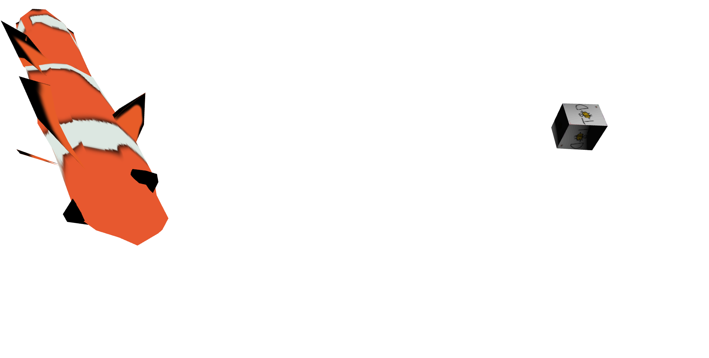
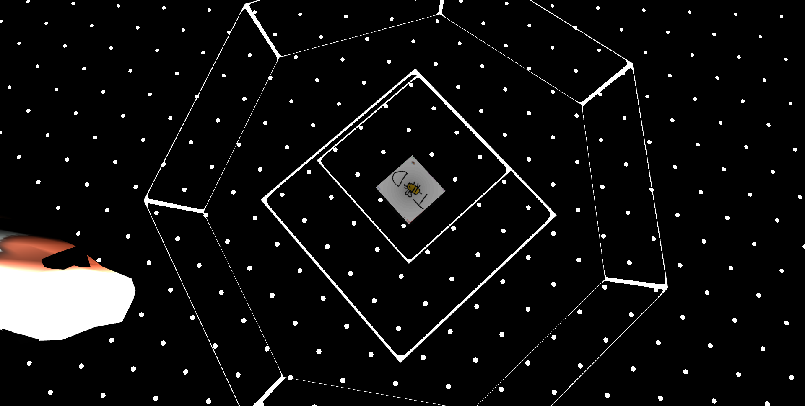

# Week 3 Report

<!-- add at least one of your latest screenshots to your group page -->

  <figure>
    
    <figcaption>
      Guys, I think I made the toon shader to have colors!
    </figcaption>
  </figure>
  <figure>
    
    <figcaption>
      I got the toon shader version 2 to work, but it's still all white and black unfortunately
    </figcaption>
  </figure>
  <figure>
    
    <figcaption>
      The current point lighting implementation on our fish1 model.
    </figcaption>
  </figure>
  <figure>
    
    <figcaption>
      The current point lighting implementation on our fish2 model.
    </figcaption>
  </figure>
  <figure>
    
    <figcaption>
      Sphere wireframe around a cube with toon shading.
    </figcaption>
  </figure>
  <figure>
    
    <figcaption>
      "cylinder"
    </figcaption>
  </figure>
  <figure>
    
    <figcaption>
      "cylinder"
    </figcaption>
  </figure>
  <figure>
    
    <figcaption>
      septagon!!
    </figcaption>
  </figure>
  <figure>
    
    <figcaption>
      cylinder
    </figcaption>
  </figure>
  <figure>
    
    <figcaption>
      map concept
    </figcaption>
  </figure>
  <figure>
    
    <figcaption>
      character concepts
    </figcaption>
  </figure>

## Group status

<!-- include both the week # and the date of the meeting -->

Meeting: [Sunday, April 21, 2024](#meeting-notes)

<!-- summarize your overall status for the week -->

Towards implementing our game logic architecture, we encapsulated our game logic into various classes, like `Game` and `Entity`, and clarified their purpose. Now they are ready to handle player input. The team is overall more familiar with how their part of the codebase works. The graphics team also explored lighting.

Our main priorities, broken down by team, are:

- Players
- Movement based on input
- A demo world
- Entity interactions

<!-- add a statement summarizing the group morale (feel free to be creative in expressing your morale) -->

On a scale from 0--9, with 0 being assgarbage and 9 being orgasmic, most of us feel around an 8.

## Individual statuses

### Nick

1. what were your concrete goals for the week?

   Continue to find a way to organize the server-side game objects so that they can be easily converted into client-side renderable things.

2. what goals were you able to accomplish?

   Wrote a Game class that encapsulates all of the game logic and manages each player's inputs. I also started structuring out different types of Entity classes with Tyler that each represent concrete objects we're having inside the game, and we solidified what an Entity's role is actually supposed to be. Additionally, I started migrating the game state to be sent from the game object instead of just the physics world, but I think Marcelo and Tyler finished that transition(?) [I wasn't able to attend the group meeting because of LA Hacks so I'm a little lost on the current status of things and what people were/are working on] Notably, I did not accomplish getting player input to cause an object to move in the physics world.

3. if the week went differently than you had planned, what were the reasons? note that this happens regularly…I would prefer you to be aggressive in what you want to try accomplish rather than limit yourself to goals you know you’ll easily achieve. so answering this question is more of a reflection on the development process and the surprises you encounter, it’s not at all an evaluation.

   I got a lot less done than I would have liked this week. Some of the lack of productivity was due to going to LA Hacks, some of it was due to finding housing, and in general, I feel like I don't have a good idea for what I should be doing next and what other people are doing. I feel like I need to get a direction again, because right now I feel a little bit directionless.

4. what are your specific goals for the next week?

   Get a player object working, set up a demo world with objects for the player to run around and jump on top of. Basically, get movement in a 3d space working and tune it (to a reasonable extent) so that it feels right. Start making game object collisions affect the Game state for certain interactions (like 2 objects colliding to make a larger or crafted object).

5. what did you learn this week, if anything (and did you expect to learn it?)

   I learned a little bit more about cannon-es and how it structures its physical world. That's about it though. I picked up some tidbits about graphic and rendering, but nothing too big.

   what is your individual morale (which might be different from the overall group morale)?

   Like I mentioned earlier, I feel a little directionless and that I need to meet up with the whole group again to get back on the same page and make sure no duplicate work is being done. I am also just starting to feel that lovely spring quarter burnout you get after doing school for 2 quarters back to back. I'm trying to get a roommate for a double for ~900 a month beginning towards the end of May so if you know anyone who needs housing, please let me know!

### Marcelo

1. what were your concrete goals for the week?

   Establishing the foundations for the server game logic such as abstractions for entities and player inputs

2. what goals were you able to accomplish?

   wrote an abstract design for base entity and other types of entities, let the cannon-es handle physics engine, partially designed a player input system, serialized the game object to send over to clients.

3. if the week went differently than you had planned, what were the reasons? note that this happens regularly…I would prefer you to be aggressive in what you want to try accomplish rather than limit yourself to goals you know you’ll easily achieve. so answering this question is more of a reflection on the development process and the surprises you encounter, it’s not at all an evaluation.

   This week went pretty much the same way as I planned, which is very validating to me.

4. what are your specific goals for the next week?

   Finish the player input system and work with Tyler on the Game logic

5. what did you learn this week, if anything (and did you expect to learn it?)

   I learned how typescript syntax can allow some crazy abstraction for scalable code base. In addition, I learned about cannon-es as a physics engine typescript package and some basics over how to use it. I did expect to learn both.

6. what is your individual morale (which might be different from the overall group morale)?

   Much much better than last week. I feel way better talking to everyone the group and I’m glad we figured out a system to make sure everyone is on track, which is writing updates to the corresponding channel in the discord.

### Tyler

1.  what were your concrete goals for the week?

    My concrete goals for the week were to:

    1. Meet with Nick and the Networking team about the restructuring we talked about in the weekly meeting
    2. Create the capsule collider and successfully lock it's y axis with Nick
    3. Create the Entity interface, and possibly create a few Entity implementations that we can test with and work on
    4. Talk with Marcello

2.  what goals were you able to accomplish?

    I think I got them all actually!

    I successfully talked with marcelo, helped the group with a little bit of a communication issue, and learned quite a bit about typescript and our current codebase.

    I'm not the group expert on the server side data, not at all, but I absolutely know my way around, and I've lost quite a bit of the imposter syndrome that I was worried about.

    I met with Nick and created the Capsule Collider for the player that we were interested in, and fully created the Entity interface with some implementations (more to come)

    The only thing that we didn't get done was locking the y axis for the capsule collider, but I'm pretty sure that it won't be too bad.

3.  if the week went differently than you had planned, what were the
    reasons? note that this happens regularly…I would prefer you to
    be aggressive in what you want to try accomplish rather than limit
    yourself to goals you know you’ll easily achieve. so answering
    this question is more of a reflection on the development process
    and the surprises you encounter, it’s not at all an evaluation.

    mmmm, there was a few things that I would have perferred to be able to get done that weren't directly on my list.

    After talking with Nick, I wanted to give myself a networking challenge, which would be to work on the game enough that we could have multiple players working on it instead of just one.
    However, I didn't actually get to work on it because of some mental health stuff, which is an acceptable loss, in my mind.

    I'm much more famailiar with networking and the codebase than I thought I would be at the beginning of the week though, which is a huge plus.

4.  what are your specific goals for the next week?

    1. Work on the branch to get multiple players on the network (not cookies)
    2. Work with Nick to get some really basic cookies working for the game
    3. Do some significant work on the actual game logic. SPECIFICALLY, I want to create an interactible entity
    4. Create some new Entity implementations so that we can be a bit more specific when working with stuff
    5. Talk with Killian about getting someone else also on Blender

5.  what did you learn this week, if anything (and did you expect to learn it?)

    I learned a huge amount about how our current codebase and networking works in general, enough that I was able to have several fairly competent discussions with other very competent people about how the current system works, and I was correctly understanding the system, which is great!

    I had absolutely no idea that I would be learning so much so fast, and I didn't think I'd be this proficient\* by this point either. I figured I would still be super far behind by now.

6.  what is your individual morale (which might be different from the
    overall group morale)?

    My morale is actually pretty okay for right now.

    I've learned quite a bit about the system, and I feel comfortable enough with it that I think I could add something small without it all breaking horrendously.

    A lot of my other side stuff is calming down as well, so I might actually have time to work on some of the backlog of personal stuff that I need to get done, which has definitely been weighing on me.

    All this is good! Basically what I'm saying is that things are starting to look up. :)

### Killian

1. My concrete goals this week were to create the rest of the concept art for the game and also start to work in 3D.

2. This week I was able to make more concept art for the game, more specifically for the map and colors for the boss and mushroom. I also ideated more on some game design elements and played around with putting together sample maps.

3. For this week, I definitely did not meet my goal of starting to work in 3D due to amount of things I had going on in the week that I mentioned in last week's report. This just means I'll have to work extra hard next week to catch up.

4. Next week, I want to complete all the necessary Blender tutorials I'll need to do and start making a working map for the team to test things on. I also want to start designing and modeling basic assets for the game like weapons and rocks, and concepting those assets as I get to them.

5. This week, I learned more about map and level design as I was planning out how our game's map should look.

6. I am still excited to work on this game, but am a bit more nervous since I am behind my goals this week. Hopefully I'll be able to do everything I want to get done this week and be back on track.

### Sean

My goal for the past week was to clean up the codebase. Unfortunately, that hasn't really happened yet. This is partly because I don't really know where the project will go graphics-wise (for example, are we going to exclusively use Blender models, or might we have models with special code, like animating a plane's vertices to have water ripples? will we have a bloom shader post-processing step? etc.) And I am still learning about the quirks of WebGL and developing a conceptual model of it. I'm not sure if we should just keep going with spaghetti code until we understand what exactly we're doing, or if we should decide now how we want to represent 3D objects in our code.

I also made smaller additions and fixes in the past week:

- Our GitHub Pages preview now spins up our server in a Web Worker. Because our server was written in JS, we can run it directly in the browser.
- Fixed our fish model not rendering on Macs.
- Added wireframe spheres.

The past week flew by faster than expected, and I'm not sure why. Maybe it's just because week 2 included some development progress from week 1, so I expected more progress this week.

Also, I thought more about how I want to refactor our graphics code. I think I will want to keep everything relatively low-level and only have helper functions wrapping WebGL calls. I think if we try to abstract away implementation details too much, we'll end up changing it frequently as we tune the visuals.

Graphics is currently still waiting on the networking team, so there isn't really much to do. I could potentially work on adding a bloom effect though.

I would say my current morale is a bit less motivated than last week, but still pretty motivated overall.

### Will

1. My goals for the past week were to implement point lighting and camera panning.

2. I implemented camera panning using the mouse and Sean extended it to work on touchscreen devices. I also made an initial point light implementation, but there are some limitations imposed by WebGL (like a small number of lights per draw) and some unresolved questions that depend on other decisions we need to make (like where to store the light objects). For the limitations, whether/how we need to find workarounds will also depend on some game design decisions, like whether we want a darker ambiance.

3. I would have liked to do more testing on the lighting implementation so we can see how many objects and lights it can handle before performance starts suffering. It took a while to iron out all the texture map and shader bugs so I didn’t get to do that as of writing this. I think it’ll end up being easier to do some stress testing anyway after we have a more well-defined client-server interaction, so I can just directly test on real entities instead of fake/temporary ones.

4. Goals for next week include testing the lighting more (make sure shadows look correct and find performance limits), solidifying our shader pipeline (e.g. figuring out how to incorporate the cel shader as a postprocessing step) with the rest of the graphics team, making some placeholder Blender models if needed, and helping Kenzo with a particle system if needed.

5. I learned that WebGL has some stricter limitations than OpenGL, e.g. on the allowed combinations of framebuffer attachments or how we have to make 6 separate draw calls to render a cubic depth map for various reasons. This is a little bit of a pain because it means that some tutorials designed for OpenGL don’t work in WebGL, and it’s not always obvious that the reason is because WebGL doesn’t let you do a particular thing that OpenGL allows. But no one said graphics is easy.

6. I think we’re still making good progress, although it’s taken longer to get client inputs onto the server than maybe we were hoping. But we have a solid graphics foundation shaping up.

### Kenzo

1. My concrete goals for the week is to fully implement the toon shader and implement the particle systems.

2. I was able to implement the toon shader into our code and fix the light position so we can see the sides that are being highlighted by the shader. I was able to start working on the particle systems.

3. I planned on finishing implementing the particle systems, however, I got busy over the weekends due to my other classes having a lot of work and other meetings.

4. My goal for the next week is to finish implementing particle systems with TransformFeedback.

5. I learned how to implement toon shaders, including how to set the uniform variables and the varyings. I also learned the code base and now I am able to understand how all the different parts of the graphics code work together. I also learned that my laptop is too old to support more than 8 textures so the graphics that are being rendered on my laptop looks different from the others, and William and Sean were able to help me debug this so that the graphics code can support older laptops.

6. I am having impostor syndrome due to my lack of experience in graphics. However, I am excited and trying my best to contribute to my team so that I can learn a lot from this class. I am very grateful to have very supportive and very experienced teammates.

## Meeting notes

Present: Sean, Marcelo, Will, Kenzo, Tyler

Excused: Killian

- Tyler: rn we are only sending are colliders. but only character model is being displayed. so how does client know what colliders belong to what model
  - game state is essentially list of entities
  - marcelo: serialize game info, like phase of the game?
    - tyler: first part of game packet could be game metadata, followed by entities. game data is later problem
    - task for Sean: read model string, display model
- (networking) Update: modified the serialization system so that it correctly serialize from the game object, mild restructurization over the entities to include their own serialzation methods
- Tyler: we will probably have to restructure the team because we are reaching a point where graphics and network are setup
