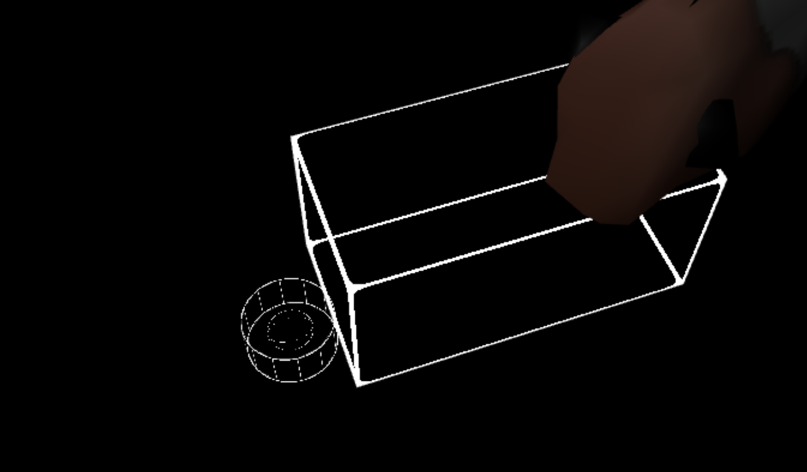
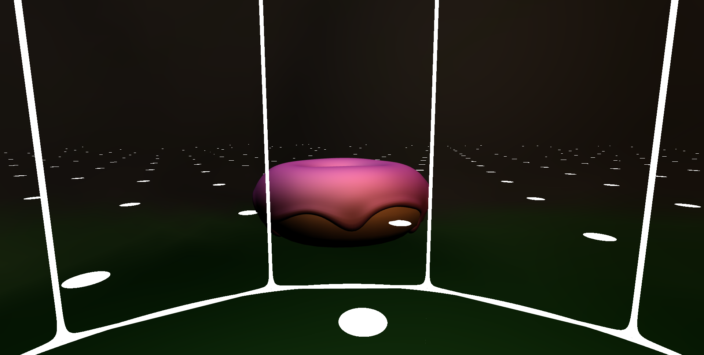

# Week 4 Report

<!-- add at least one of your latest screenshots to your group page -->

  <figure>
    <video src="../../images/dev/movement.mp4" controls preload="none" poster="../../images/dev/movement-poster.png"></video>
    <figcaption>
      It lives!!
    </figcaption>
  </figure>
  <figure>
    
    <figcaption>
      it took me too long to realize why the cylinder wasn't rendering. it's just smaller than the model 💀 💀
    </figcaption>
  </figure>
  <figure>
    <video src="../../images/dev/more-shapes.mp4" controls preload="none" poster="../../images/dev/more-shapes-poster.png"></video>
    <figcaption>
      I hacked in some more shapes (temporary) to play around with
    </figcaption>
  </figure>
  <figure>
    <video src="../../images/dev/first-person.mp4" controls preload="none" poster="../../images/dev/first-person-poster.png"></video>
    <figcaption>
      I added camera locking support so it's now a first person game
    </figcaption>
  </figure>
  <figure>
    
    <figcaption>
      learn how he fixed player movement with just this one line 🤯
    </figcaption>
  </figure>
  <figure>
    
    <figcaption>
      kenzo's particles !!
    </figcaption>
  </figure>
  <figure>
    
    <figcaption>
      idea-ing
    </figcaption>
  </figure>
  <figure>
    
    <figcaption>
      adding another model and for some reason it only renders when the other models aren't loaded
    </figcaption>
  </figure>
  <figure>
    
    <figcaption>
      you can see the shadows cast by the cubes onto th eground though
    </figcaption>
  </figure>
  <figure>
    <video src="../../images/dev/moving-lights.mp4" controls preload="none" poster="../../images/dev/moving-lights-poster.png"></video>
    <figcaption>
      i made the lights move lol. yeah i put the entire world inside a default blender cube
    </figcaption>
  </figure>
  <figure>
    
    <figcaption>
      ill try it now w the donut
    </figcaption>
  </figure>
  <figure>
    
    <figcaption>
      oh lol i was wondering where the black lines were coming from and i think it's just the walls of the cavern being casted on itself. oh it's because the shadow camera's position isn't being updated
    </figcaption>
  </figure>
  <figure>
    
    <figcaption>
      yay sample map! it doesnt have color or anything
    </figcaption>
  </figure>
  <figure>
    
    <figcaption>
      these shadows casted are cool
    </figcaption>
  </figure>

## Group status

<!-- include both the week # and the date of the meeting -->

Meeting: [Sunday, April 28, 2024](#meeting-notes)

<!-- summarize your overall status for the week -->

<!-- add a statement summarizing the group morale (feel free to be creative in expressing your morale) -->

## Individual statuses

1. what were your concrete goals for the week?
1. what goals were you able to accomplish?
1. if the week went differently than you had planned, what were the reasons? note that this happens regularly...I would prefer you to be aggressive in what you want to try accomplish rather than limit yourself to goals you know you’ll easily achieve. so answering this question is more of a reflection on the development process and the surprises you encounter, it’s not at all an evaluation.
1. what are your specific goals for the next week?
1. what did you learn this week, if anything (and did you expect to learn it?)
1. what is your individual morale (which might be different from the overall group morale)?

### Nick

### Marcelo

### Tyler

### Killian

### Sean

Last week, I didn't really establish any concrete goals. I said I'd push off refactoring our rendering engine until we had a more concrete idea of what our game would look like. I ended up exceeding my expectations for this week, as well as making some smaller changes, including:

- Added the ability for the server to lock a camera's position to that of an entity, effectively making the game a first-person game.

- Defined an interface `Model` for a model that an entity could reference---a model for an entity is like a costume for a Scratch sprite. This is part of the refactoring I wanted in the graphics code, so this should open up the door for other code cleanups and clarify the mental model for how we want to represent different model formats in our game.

- Added more Blender models and fixed errors that arose.

- Massively improved performance just by removing `checkError` calls that were no longer used. Adding Killian's concept player and map models greatly killed the frame rate, and that was because he built them out of many meshes (cubes and planes) in Blender, and drawing each mesh calls `checkError` multiple times. A `checkError` call requires waiting on the GPU to finish whatever it's doing, which can take a while. Our game is smooth again, at least for now.

I found this [WebGL state diagram](https://webglfundamentals.org/webgl/lessons/resources/webgl-state-diagram.html) that really helped me understand how OpenGL/WebGL's state machine works and what state affects what. A lot of the bugs I encountered this week were due to the WebGL state being left in an unexpected state, so I think next week we should refactor our code to keep all state in one class, then pass the state that we want in a declarative way to the class. The class can then figure out what WebGL calls need to be made.

My current morale is still pretty motivated. However, I'm a bit discontent that the networking side of the project is currently broken, so the player can't move once it lands.

### Will

### Kenzo

## Meeting notes

Present: Kenzo, Sean, Will, Killian, Marcelo

Hawaii: Nick

- nick is gone, tyler has done nothing
- marcelo: framework for physics materials
  - folder of all materials
  - export every material
  - then use it in the game class
- thursday: kenzo added particles
  - it appears they are broken now
- we need to make another camera for the boss. Will's job
- game will be first person, so map will prioritize that. make map bigger for players. killian should prioritize adding details
- main purpose of meeting: updates
- particle system is working
- will discuss game design after we get everything working
- Tyler/networking: new entities, work on player movement
- graphics: need to get pipeline working (toon shading)

We proceeded to do a social at UTC.
