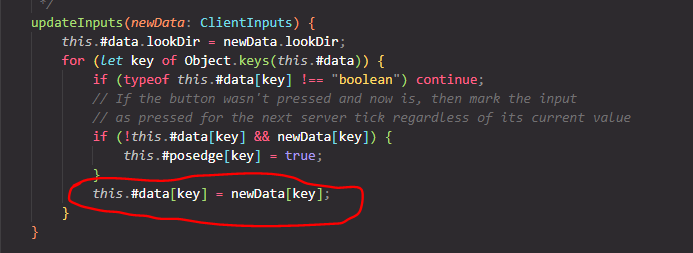
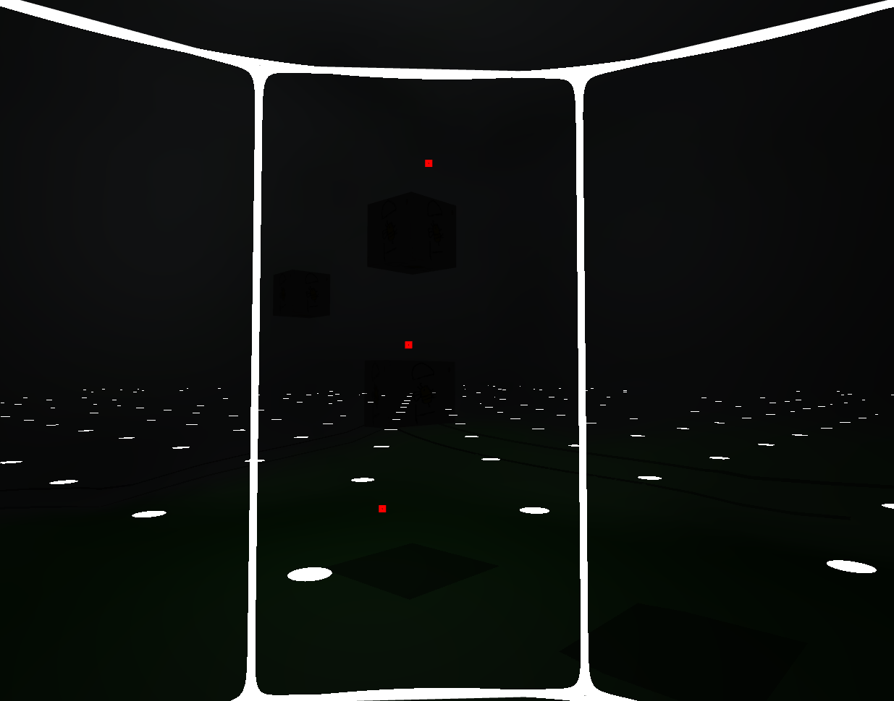
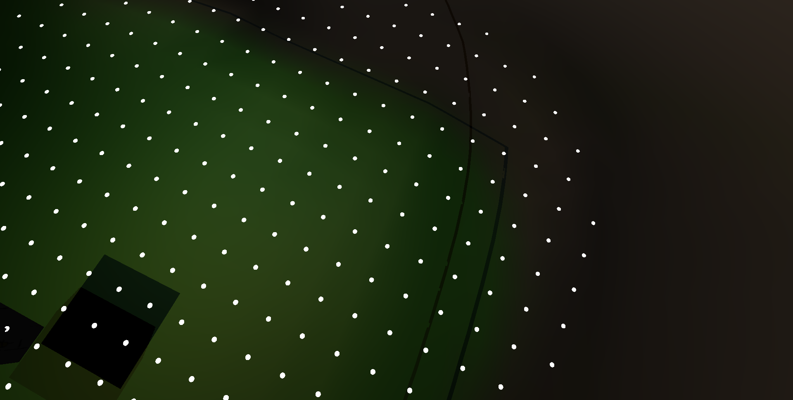

# Week 4 Report

<!-- add at least one of your latest screenshots to your group page -->

  <figure>
    <video src="../../images/dev/movement.mp4" controls preload="none" poster="../../images/dev/movement-poster.png"></video>
    <figcaption>
      It lives!!
    </figcaption>
  </figure>
  <figure>
    
    <figcaption>
      it took me too long to realize why the cylinder wasn't rendering. it's just smaller than the model 💀 💀
    </figcaption>
  </figure>
  <figure>
    <video src="../../images/dev/more-shapes.mp4" controls preload="none" poster="../../images/dev/more-shapes-poster.png"></video>
    <figcaption>
      I hacked in some more shapes (temporary) to play around with
    </figcaption>
  </figure>
  <figure>
    <video src="../../images/dev/first-person.mp4" controls preload="none" poster="../../images/dev/first-person-poster.png"></video>
    <figcaption>
      I added camera locking support so it's now a first person game
    </figcaption>
  </figure>
  <figure>
    
    <figcaption>
      learn how he fixed player movement with just this one line 🤯
    </figcaption>
  </figure>
  <figure>
    
    <figcaption>
      kenzo's particles !!
    </figcaption>
  </figure>
  <figure>
    
    <figcaption>
      idea-ing
    </figcaption>
  </figure>
  <figure>
    
    <figcaption>
      adding another model and for some reason it only renders when the other models aren't loaded
    </figcaption>
  </figure>
  <figure>
    
    <figcaption>
      you can see the shadows cast by the cubes onto th eground though
    </figcaption>
  </figure>
  <figure>
    <video src="../../images/dev/moving-lights.mp4" controls preload="none" poster="../../images/dev/moving-lights-poster.png"></video>
    <figcaption>
      i made the lights move lol. yeah i put the entire world inside a default blender cube
    </figcaption>
  </figure>
  <figure>
    
    <figcaption>
      ill try it now w the donut
    </figcaption>
  </figure>
  <figure>
    
    <figcaption>
      oh lol i was wondering where the black lines were coming from and i think it's just the walls of the cavern being casted on itself. oh it's because the shadow camera's position isn't being updated
    </figcaption>
  </figure>
  <figure>
    
    <figcaption>
      yay sample map! it doesnt have color or anything
    </figcaption>
  </figure>
  <figure>
    
    <figcaption>
      these shadows casted are cool
    </figcaption>
  </figure>

## Group status

<!-- include both the week # and the date of the meeting -->

Meeting: [Sunday, April 28, 2024](#meeting-notes)

<!-- summarize your overall status for the week -->

<!-- add a statement summarizing the group morale (feel free to be creative in expressing your morale) -->

## Individual statuses

1. what were your concrete goals for the week?
1. what goals were you able to accomplish?
1. if the week went differently than you had planned, what were the reasons? note that this happens regularly...I would prefer you to be aggressive in what you want to try accomplish rather than limit yourself to goals you know you’ll easily achieve. so answering this question is more of a reflection on the development process and the surprises you encounter, it’s not at all an evaluation.
1. what are your specific goals for the next week?
1. what did you learn this week, if anything (and did you expect to learn it?)
1. what is your individual morale (which might be different from the overall group morale)?

### Nick

### Marcelo

### Tyler

1.  what were your concrete goals for the week?
    My concrete goals for the week were to:

    1. Work on the branch to get multiple players on the network (not cookies)
    2. Work with Nick to get some really basic cookies working for the game
    3. Do some significant work on the actual game logic. SPECIFICALLY, I want to create an interactible entity
    4. Create some new Entity implementations so that we can be a bit more specific when working with stuff
    5. Talk with Killian about getting someone else also on Blender

2.  what goals were you able to accomplish?

    Honestly, I don't think I got any of the goals done. This week was weirdly difficult for me, and I didn't get about any work on the game done at all.

3.  if the week went differently than you had planned, what were the
    reasons? note that this happens regularly…I would prefer you to
    be aggressive in what you want to try accomplish rather than limit
    yourself to goals you know you’ll easily achieve. so answering
    this question is more of a reflection on the development process
    and the surprises you encounter, it’s not at all an evaluation.

    I was right, I was super tired for the week and didn't get much done at all. Had to crunch for a few other classes and a quiz and things like it.

    I really wish that I could've found the effort to push through for some of the simpler stuff, like creating a basic, unimplemeted interactible entity, because then I could've had a base to work off of, but I really haven't done any of that.

    I did talk with Killian a bit though, and it's not looking like he's going to need anyone else on blender so far.

4.  what are your specific goals for the next week?

    1. Work on the branch to get multiple players on the network (not cookies)
    2. Work with Nick to get some really basic cookies working for the game
    3. Do some significant work on the actual game logic. SPECIFICALLY, I want to create an interactible entity
    4. Create some new Entity implementations so that we can be a bit more specific when working with stuff
    5. Work on the physics of the player model, because it's a bit broken right now
    6. Work on some game design of the map with Killian, hopefully

5.  what did you learn this week, if anything (and did you expect to learn it?)

    I don't know if I learned much this week.

    It was definitely unexpected how difficult it was, and for seemingly no reason. Mental health is weird, man.

6.  what is your individual morale (which might be different from the
    overall group morale)?

    My morale is actually pretty terrible.

    My guess is that group morale is great, especially given that the last meeting we had was more of a social than it was an actual group meeting, but my inability to work on this project (which is small, but I think much larger than what the rest of the group really thinks it is) is going to grate at me for another week or so.

    I would really love to get some serious help in this project other than project management, because it still feels like I'm a liability instead of a leading force.

### Killian

1. My concrete goals this week were to finish some Blender tutorials and start making a working map and other game assets in 3D.

2. This week I was able to finish the Blender tutorials I wanted to finish, export a donut for the team to put into the game, then made a sample map and player to also be put into the game.

3. For this week, I did meet my goals from last week but I definitely wanted to make more even more assets in 3D so I could better get used to the work flow of it.

4. Next week, I want to focus on working almost exclusively in 3D, either adding more details to the map, making a finalized version of the player, or start on the boss and evil mushroom entities.

5. This week, I learned more a lot more about the 3D modeling workflow, both on the modeling side and the exporting side.
6. I feel better than last week since I actually accomplished the goals that I set last week this week. I also enjoyed hanging out with the team outside of a working/meeting environment this week!

### Sean

Last week, I didn't really establish any concrete goals. I said I'd push off refactoring our rendering engine until we had a more concrete idea of what our game would look like. I ended up exceeding my expectations for this week, as well as making some smaller changes, including:

- Added the ability for the server to lock a camera's position to that of an entity, effectively making the game a first-person game.

- Defined an interface `Model` for a model that an entity could reference---a model for an entity is like a costume for a Scratch sprite. This is part of the refactoring I wanted in the graphics code, so this should open up the door for other code cleanups and clarify the mental model for how we want to represent different model formats in our game.

- Added more Blender models and fixed errors that arose.

- Massively improved performance just by removing `checkError` calls that were no longer used. Adding Killian's concept player and map models greatly killed the frame rate, and that was because he built them out of many meshes (cubes and planes) in Blender, and drawing each mesh calls `checkError` multiple times. A `checkError` call requires waiting on the GPU to finish whatever it's doing, which can take a while. Our game is smooth again, at least for now.

I found this [WebGL state diagram](https://webglfundamentals.org/webgl/lessons/resources/webgl-state-diagram.html) that really helped me understand how OpenGL/WebGL's state machine works and what state affects what. A lot of the bugs I encountered this week were due to the WebGL state being left in an unexpected state, so I think next week we should refactor our code to keep all state in one class, then pass the state that we want in a declarative way to the class. The class can then figure out what WebGL calls need to be made.

My current morale is still pretty motivated. However, I'm a bit discontent that the networking side of the project is currently broken, so the player can't move once it lands.

### Will

1. Test lighting/shadows, create a shader pipeline with postprocessing steps, help out with particle system and Blender models if needed.

2. I wrote the foundation for a shader pipeline which renders the scene to a 2D texture and then renders that texture onto a screen-filling plane; the plan is to be able to add and swap out arbitrary 2D effects/filters (e.g. cel shading, bloom) as additional shader programs acting on the texture. In order to make it easier to inspect our lighting effects, I also added a client-side freecam mode.

3. I still wasn’t able to test out the lighting very much because we didn’t quite have models or an interface to the physics engine ready yet. However, what I’ve seen so far looked correct, and we have more of the systems in place which bring us closer to being able to drop our models into the game world.

4. Flesh out the shader pipeline, convert Kenzo’s toon shader into a 2D version that we can add to the pipeline, maybe help fix lighting bugs with the map model or move to game logic.

5. It seems safer to just clean up completely after every WebGL operation, e.g. unbind all textures and buffers. Otherwise we get errors that are very hard to identify and debug.

6. Good. We had a sort of team social over the weekend where we went to UTC which was pretty fun. I’m looking forward to the point where we can start focusing on game logic after the engine/platform is done.

### Kenzo

1. what were your concrete goals for the week?

   Finish implementing particle systems and try to modify them so it is expandable.

2. what goals were you able to accomplish?

   I was able to finish implementing the particle systems and was able to tweak the particle's speed and positions and colors.

3. if the week went differently than you had planned, what were the reasons? note that this happens regularly…I would prefer you to be aggressive in what you want to try accomplish rather than limit yourself to goals you know you’ll easily achieve. so answering this question is more of a reflection on the development process and the surprises you encounter, it’s not at all an evaluation.

   I was surprised that a lot of errors came up during my implementation. I was stuck on those errors for a long time so I asked Sean to help me debug the code. He was able to fix and adjust some of the code so that those errors disappeared. Thanks to Sean's help, we were able to make the particle system work.

4. what are your specific goals for the next week?

   Continue modifying the particle systems so it can do cooler stuff!

5. what did you learn this week, if anything (and did you expect to learn it?)

   I learned about TransformFeedback and how it is used to avoid doing calculation on the CPU and pushing the changes to the buffer directly so it optimizes the code and reduce lag.

6. what is your individual morale (which might be different from the overall group morale)?

   I am excited to learn more about the graphics side of the code and hoping that I can also go into the networking side to help other members.

## Meeting notes

Present: Kenzo, Sean, Will, Killian, Marcelo

Hawaii: Nick

- nick is gone, tyler has done nothing
- marcelo: framework for physics materials
  - folder of all materials
  - export every material
  - then use it in the game class
- thursday: kenzo added particles
  - it appears they are broken now
- we need to make another camera for the boss. Will's job
- game will be first person, so map will prioritize that. make map bigger for players. killian should prioritize adding details
- main purpose of meeting: updates
- particle system is working
- will discuss game design after we get everything working
- Tyler/networking: new entities, work on player movement
- graphics: need to get pipeline working (toon shading)

We proceeded to do a social at UTC.
