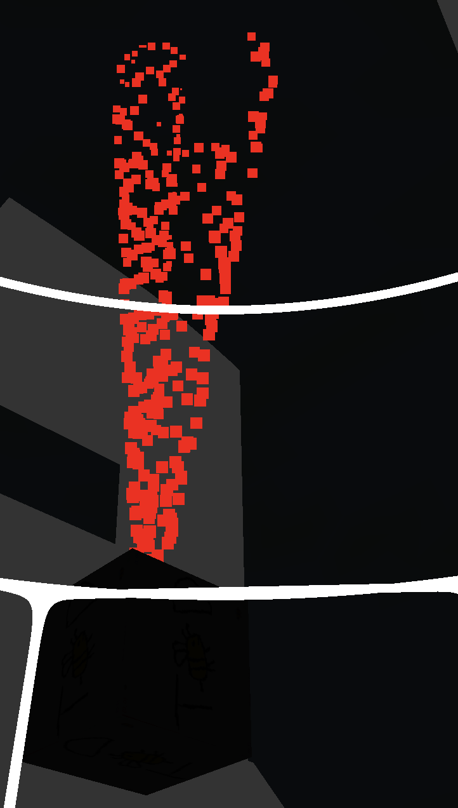
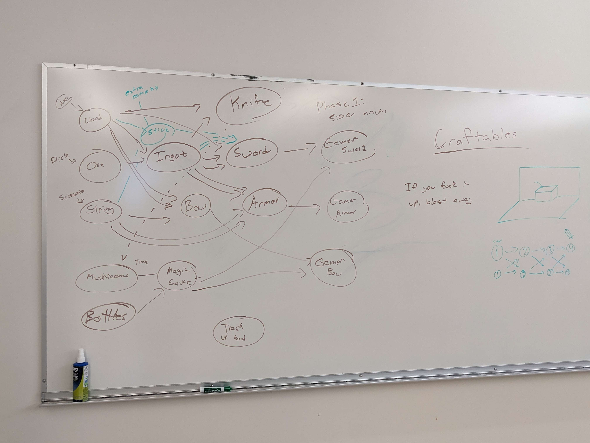

# Week 5 Report

<!-- add at least one of your latest screenshots to your group page -->

  <figure>
    
    <figcaption>
      I made a red water fountain!
    </figcaption>
  </figure>
  <figure>
    
    <figcaption>
      It's a tornado now
    </figcaption>
  </figure>
  <figure>
    
    <figcaption>
      Outlines
    </figcaption>
  </figure>

## Group status

<!-- include both the week # and the date of the meeting -->

Meeting: [Sunday, May 5, 2024](#meeting-notes)

<!-- summarize your overall status for the week -->

<!-- add a statement summarizing the group morale (feel free to be creative in expressing your morale) -->

## Individual statuses

1. what were your concrete goals for the week?
1. what goals were you able to accomplish?
1. if the week went differently than you had planned, what were the reasons? note that this happens regularly...I would prefer you to be aggressive in what you want to try accomplish rather than limit yourself to goals you know you’ll easily achieve. so answering this question is more of a reflection on the development process and the surprises you encounter, it’s not at all an evaluation.
1. what are your specific goals for the next week?
1. what did you learn this week, if anything (and did you expect to learn it?)
1. what is your individual morale (which might be different from the overall group morale)?

### Nick

### Marcelo

### Tyler

### Killian

### Sean

### Will

### Kenzo

## Meeting notes

Present: Sean, Kenzo, Will, Killian, Tyler, Nick

- Sean: we should pivot graphics team into game logic
- currently working on:
  - collision response (Marcelo is working on this). like slapping an object
    - **BIG!!!**
    - nick can do this with Marcelo
    - determining what to do
    - eg when item collides with table, it can disappear if there's a recipe
  - interacting
    - currently, we only have two buttons (two ways of interacting w world: attack and use)
      - current two are fine
      - we have all important EMOTE button
      - examples:
        - to throw, can press interact w nothing in front of you
        - if something is ready to be crafted, hit it instead of interact
        - so we don't have throw button, etc.
    - not that bad after collision response
    - interacting depends on collision response
  - ~~animations~~
    - sean: not MVP. we're still waiting on art, and animations takes even longer. can deprioritize
    - nick: can have squish/stretch animations
      - sean: not MVP. but if we are short on time
  - ~~UI~~: eg menus, health bar
    - we dont have a health system, UI has nothing to show
      - we might not need health system at all
        - could store per player
        - stored in game object or player entity (not added yet)
      - we would just need timer
    - show what players are holding
    - sean: we can deprioritize art
  - multiplayer
    - Nick can work on this
    - Sean could too
      - Nick and Sean are not allowed to work together
    - Tyler and Nick will work on this
  - collision response + interaction => crafting
    - CraftingTable.ts
  - map collisions
    - funky because we don't know how to do it
    - blender export bounding boxes? but we have no research of this
      - could get weird. if so, abandon this approach and do it manually
    - will + kenzo work on this
- we do need to improve movement, but we already can walk around. lower priority
- we took last 1--2 weeks off. it's week 6 and we dont have a game yet
- we're not finished with engine but we're close. just need to populate it
- graphics needs to rotate map
  - details waiting on art
- sean: everyone (except killian) works on networkin
  - lots of things graphics could work on, but not MVP
- nick: have we decided on items
  - yes, but nick was at hawaii
- timeline, we are behind by a week
- if we can get everyone in the game by next week, we're balling
  - could even turn game into "sit by a campfire" game
    - or study VC game

  <figure>
    
    <figcaption>
      Crafting tree
    </figcaption>
  </figure>
  <figure>
    
    <figcaption>
      Game logic assignments
    </figcaption>
  </figure>

Summary:

- Collision response: Marcelo and Sean
- Map collisions: Will and Kenzo
- Multiplayer: Nick and Tyler
