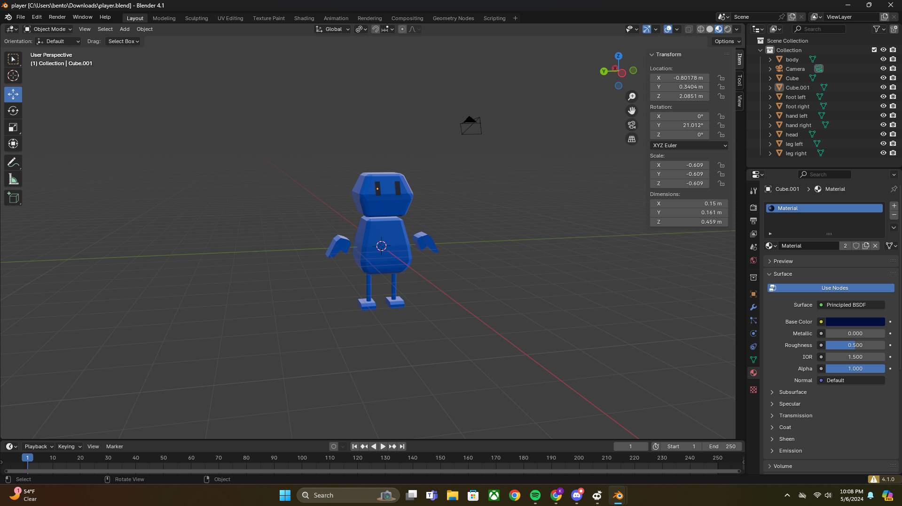
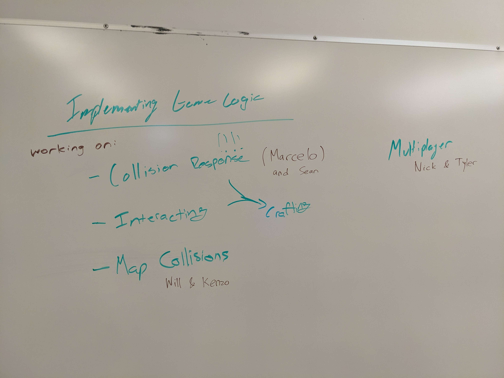

# Week 5 Report

<!-- add at least one of your latest screenshots to your group page -->

  <figure>
    
    <figcaption>
      I made a red water fountain!
    </figcaption>
  </figure>
  <figure>
    
    <figcaption>
      It's a tornado now
    </figcaption>
  </figure>
  <figure>
    
    <figcaption>
      Outlines
    </figcaption>
  </figure>
  <figure>
    
    <figcaption>
      pickaxe!
    </figcaption>
  </figure>
  <figure>
    
    <figcaption>
      player!
    </figcaption>
  </figure>

## Group status

<!-- include both the week # and the date of the meeting -->

Meeting: [Sunday, May 5, 2024](#meeting-notes)

<!-- summarize your overall status for the week -->

We added collision detection, cel shading, outlines, and more particles.

We feel like we are behind schedule, so towards our MVP, we are repivoting our graphics team to help with implementing game logic:

- Marcelo and Sean will work on interactions with game objects.
- Will and Kenzo will look into defining map collision boxes using Blender.
- Tyler and Nick will add multiplayer support to the game.
- Killian will continue working on more models for our game, including [item models for our crafting tree](#crafting).

<!-- add a statement summarizing the group morale (feel free to be creative in expressing your morale) -->

Our morale is experiencing lag this week.

## Individual statuses

### Nick

### Marcelo

1. what were your concrete goals for the week?

   Finetune player movement AND start working on game logic

2. what goals were you able to accomplish?

   Create an abstraction for collision detection so that each type of entity can easily define their own function to process collision. Also added a check for whether the player is on the ground to process jump inputs

3. if the week went differently than you had planned, what were the reasons? note that this happens regularly…I would prefer you to be aggressive in what you want to try accomplish rather than limit yourself to goals you know you’ll easily achieve. so answering this question is more of a reflection on the development process and the surprises you encounter, it’s not at all an evaluation.

   This week went pretty much the same way as I planned, although the protest situations are a little bit concerning

4. what are your specific goals for the next week?

   Connect collision with game logic and get to game phases and game play

5. what did you learn this week, if anything (and did you expect to learn it?)

   I learned how cannon-es handles collisions and how to design collision abstraction (i copied the way unity let devs handle collision on entities)

6. what is your individual morale (which might be different from the overall group morale)?

   A little bit worried because I forsee that my groupmates might not have as much time this following week on the project

### Tyler

1.  what were your concrete goals for the week?

    My concrete goals for the week were to:

    1. Work on the branch to get multiple players on the network (not cookies)
    2. Work with Nick to get some really basic cookies working for the game
    3. Do some significant work on the actual game logic. SPECIFICALLY, I want to create an interactible entity
    4. Create some new Entity implementations so that we can be a bit more specific when working with stuff
    5. Work on the physics of the player model, because it's a bit broken right now
    6. Work on some game design of the map with Killian, hopefully

2.  what goals were you able to accomplish?

    I got a good few of my goals done, and for the rest we had a great meeting two days ago to talk about it and spread things out.

    Getting new players on the network was given to Sean and Nick, and they're going through that. Me and Marcelo are working on implementing collisions and some basic game logic. I've implemeted a skeleton version of it already.

    This includes the Entity implemetations! I punched through those.

    I also managed to talk through some of the basic crafting systems at a previous meeting, which isn't the same as going through some map design but hey we take it.

    I fixed the bug with the physics of the player model and player movement. It's not perfect, and has some clear bugs, but it's in a tunable state.

3.  if the week went differently than you had planned, what were the
    reasons? note that this happens regularly…I would prefer you to
    be aggressive in what you want to try accomplish rather than limit
    yourself to goals you know you’ll easily achieve. so answering
    this question is more of a reflection on the development process
    and the surprises you encounter, it’s not at all an evaluation.

    The week went okay! I've got a serious case of senioritis, and I'm needing to push myself to work on project that I actually want to work on (this one) because I would prefer to do literally nothing, but I'm gettin through it! It's a huge improvement from last week, which is really good.

4.  what are your specific goals for the next week?

    1. Finish the recipe system
    2. create some model-less crafting tables and test that they work with a variety of resources
    3. create a small variety of resources
    4. Maybe have the white box test complete, so we can all play the game together? that would be really cool

5.  what did you learn this week, if anything (and did you expect to learn it?)

    Uhhh. I learned that breaks are nice.
    I don't know if I learned a ton about typescript, coding, the project or anything project manager related. This week was a lot calmer than previous weeks, and that's an okay thing I think.

6.  what is your individual morale (which might be different from the
    overall group morale)?

    Actually is okay! I would say that I'm something like a 6-7/10, which I can absolutely take. I'm hoping that this week will be a lot more productive than last week, and I can schedule some more meetings to work on the codebase and get things actually functioning.

### Killian

1. My concrete goals for this week was to continue working in 3D to either add more details to the map, make a finalized version for the player, or start on new entities

2. This week I was able to finish the finalized version of the player and also made basic tools for the game.

3. For this week, I did meet my goals from last week except for making the mushroom entities.

4. Next week, I want to focus on making all the tools we need in the game along with some basic resources. With them, I also want to make 3 more versions of the player so we can be ready for multiplayer testing.

5. This week, I've gotten more comfortable with the Blender workflow and am able to make models a lot faster thanks to this.

6. I feel good this week with where I'm at, but I definitely want to pick up the pace with things.

### Sean

I set a goal for this week to refactor our code to have a better stage manager for WebGL. I did start working on that, but I might decide against adding it since our code already works right now, and forcing everyone to use helper methods might make it more difficult to, say, follow WebGL tutorials, which would use WebGL calls directly.

I didn't really do much in the past week other than making a few fixes, so I didn't really learn anything. My midterms are this week, so I think I can blame that, but also I didn't really set any other goals (graphics is well past MVP at this point). So I should be more ambitious this week. I brought up in the meeting that we should pivot everyone towards networking and implementing the game logic, so this should give us more stuff to work on.

My goals for this week are:

- Collision response and interacting, with Marcelo. Apparently Marcelo has already implemented collision response (we were not informed of this until he arrived after the meeting), so now we can add interacting. I believe this encompasses selecting objects, picking them up, and throwing them.
- Tyler also wanted animations and UI. In the meeting, I argued they were low priority (so we crossed them off), but if we're done with or I get bored of dealing with the physics engine, I could look into that---I don't know if Killian will have time to add animations to his models. But I am most familiar with the glTF format (which supports animation) as well as designing and implementing UIs in HTML/CSS.

My current morale is a bit less motivated than previous weeks because it feels like we still have a long way to go before even having a basic multiplayer scene that we can throw objects around in. But hopefully with everyone working on getting the game implemented, we'll get to see gameplay soon.

### Will

1. Flesh out the shader postprocessing pipeline, convert Kenzo’s toon shader into a 2D version that we can add to the postprocessing pipeline, implement a top-down third-person view.

2. I implemented the top-down POV and the rest of the shader pipeline. It turned out that toon/cel shading is usually done in a 3D shader because it really helps to have information about the lights and normals, at least for the two-tone cel shading style that is pretty common. So I moved it into the fragment shader that we’ll probably use for all our models, but I did also add a 2D postprocessing step that draws outlines around objects using the depth buffer.

3. See previous answer about cel shading. The current shader is a little messy now, so we might want to clean it up and organize it better once we know more about how the game should look. And that will come once we have more real game objects to render.

4. Work with Kenzo to research and implement map collisions. We will start by trying to use the Trimesh shape class from cannon.js, i.e. loading the triangle mesh from the file containing the level map and setting it on a physics collider. Presumably this should be well-optimized in the library with suitable data structures, but if we find that it runs poorly then we’ll explore alternatives such as extracting bounding boxes from the Blender file.

5. See above about cel shading. I assumed it could be done purely as a filter over the image, but there’s more complexity than that. Since it’s not a realistic lighting model to begin with, it doesn’t make sense to render a “realistic” image with Blinn-Phong lighting and then filter that.

6. Not bad. We’re a little behind on our timeline but that’s software engineering.

### Kenzo

1. what were your concrete goals for the week?

   My goals for the week is to further create more complex particle systems

1. what goals were you able to accomplish?

   I was able to make my particle systems looks like a fire hydrant and was able to make it so that we are able to set the number of particles, then I change the particles from boxes into spheres and make it look like a vortex.

1. if the week went differently than you had planned, what were the reasons? note that this happens regularly…I would prefer you to be aggressive in what you want to try accomplish rather than limit yourself to goals you know you’ll easily achieve. so answering this question is more of a reflection on the development process and the surprises you encounter, it’s not at all an evaluation.

   I think the week goes well because I was able to complete my goal for the week.

1. what are your specific goals for the next week?

   Research on how the gltf parser works and translate the map into trimesh so that we are able to make map collisions for the game.

1. what did you learn this week, if anything (and did you expect to learn it?)

   I learned about making instances on the graphics side of the code so I was able to determine how many instances of the particles that I want to output.

1. what is your individual morale (which might be different from the overall group morale)?

   I’m really having fun and learned a lot from doing this project. I hope that I can contribute to the networking side for the map collisions but I think it will be another high learning curve.

## Meeting notes

Present: Sean, Kenzo, Will, Killian, Tyler, Nick

- Sean: we should pivot graphics team into game logic
- currently working on:
  - collision response (Marcelo is working on this). like slapping an object
    - **BIG!!!**
    - nick can do this with Marcelo
    - determining what to do
    - eg when item collides with table, it can disappear if there's a recipe
  - interacting
    - currently, we only have two buttons (two ways of interacting w world: attack and use)
      - current two are fine
      - we have all important EMOTE button
      - examples:
        - to throw, can press interact w nothing in front of you
        - if something is ready to be crafted, hit it instead of interact
        - so we don't have throw button, etc.
    - not that bad after collision response
    - interacting depends on collision response
  - ~~animations~~
    - sean: not MVP. we're still waiting on art, and animations takes even longer. can deprioritize
    - nick: can have squish/stretch animations
      - sean: not MVP. but if we are short on time
  - ~~UI~~: eg menus, health bar
    - we dont have a health system, UI has nothing to show
      - we might not need health system at all
        - could store per player
        - stored in game object or player entity (not added yet)
      - we would just need timer
    - show what players are holding
    - sean: we can deprioritize art
  - multiplayer
    - Nick can work on this
    - Sean could too
      - Nick and Sean are not allowed to work together
    - Tyler and Nick will work on this
  - collision response + interaction => crafting
    - CraftingTable.ts
  - map collisions
    - funky because we don't know how to do it
    - blender export bounding boxes? but we have no research of this
      - could get weird. if so, abandon this approach and do it manually
    - will + kenzo work on this
- we do need to improve movement, but we already can walk around. lower priority
- we took last 1--2 weeks off. it's week 6 and we dont have a game yet
- we're not finished with engine but we're close. just need to populate it
- graphics needs to rotate map
  - details waiting on art
- sean: everyone (except killian) works on networkin
  - lots of things graphics could work on, but not MVP
- nick: have we decided on items
  - yes, but nick was at hawaii
- timeline, we are behind by a week
- if we can get everyone in the game by next week, we're balling
  - could even turn game into "sit by a campfire" game
    - or study VC game

  <figure id="crafting">
    
    <figcaption>
      Crafting tree
    </figcaption>
  </figure>
  <figure>
    
    <figcaption>
      Game logic assignments
    </figcaption>
  </figure>

Summary:

- Collision response: Marcelo and Sean
- Map collisions: Will and Kenzo
- Multiplayer: Nick and Tyler
