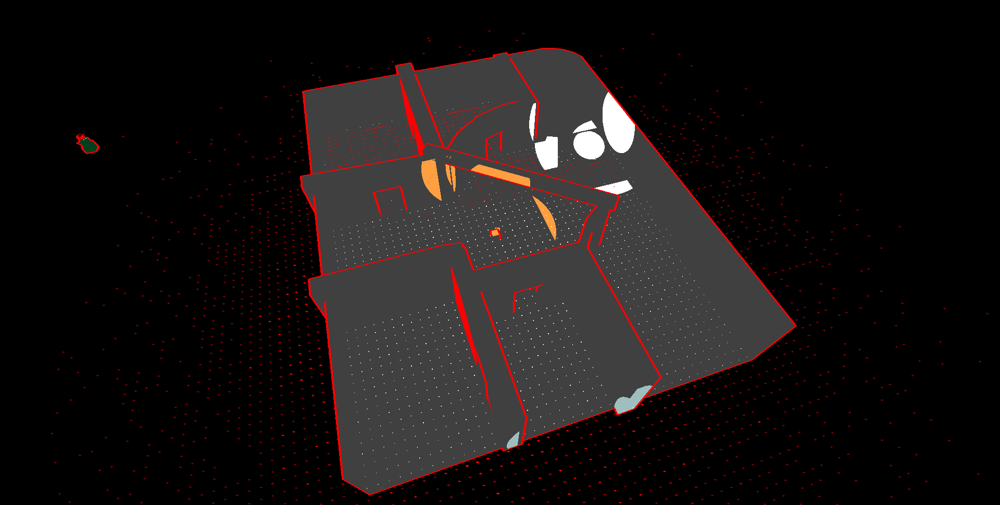
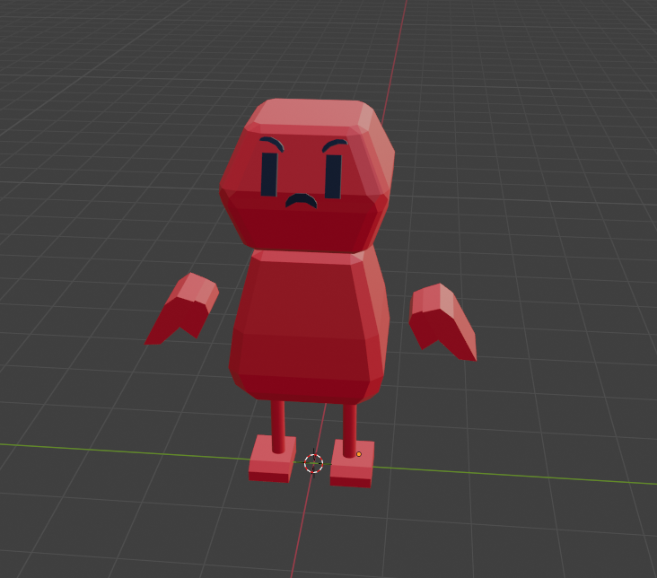
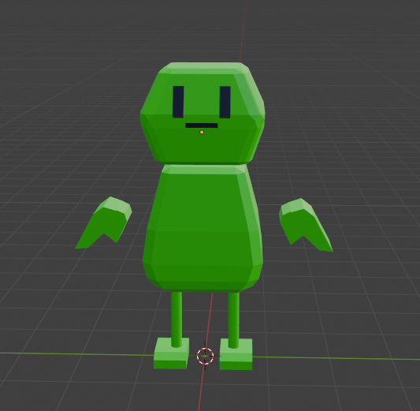
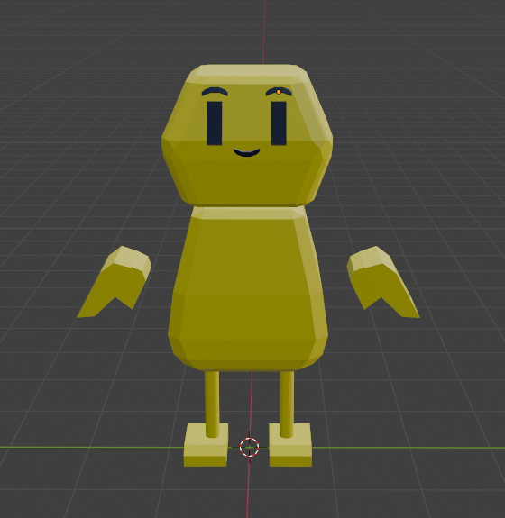
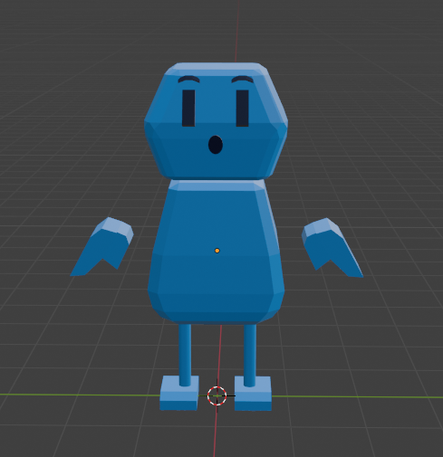
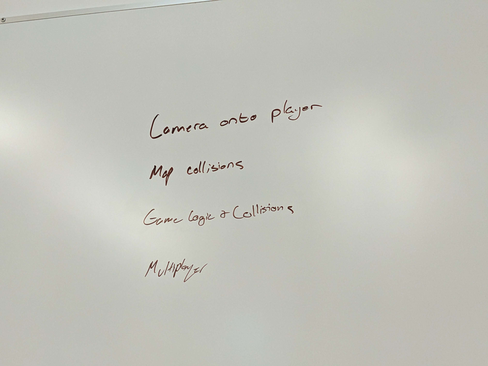

# Week 6 Report

<!-- add at least one of your latest screenshots to your group page -->

  <figure>
    <video src="../../images/dev/spinning-model.mp4" controls preload="none" poster="../../images/dev/spinning-model-poster.png"></video>
    <figcaption>
      The models look pretty funny when attached to a rolling ball
    </figcaption>
  </figure>
  <figure>
    
    <figcaption>
      i rotated the map so it's on the ground now
    </figcaption>
  </figure>
  <figure>
    
    <figcaption>
      pick your fighter &gt;:(
    </figcaption>
  </figure>
  <figure>
    
    <figcaption>
      pick your fighter :|
    </figcaption>
  </figure>
  <figure>
    
    <figcaption>
      pick your fighter :)
    </figcaption>
  </figure>
  <figure>
    
    <figcaption>
      pick your fighter :o
    </figcaption>
  </figure>
  <figure>
    <video src="../../images/dev/holding.mov" controls preload="none" poster="../../images/dev/holding-poster.png"></video>
    <figcaption>
      We forgot to disable colliders for objects in hand
    </figcaption>
  </figure>
  <figure>
    <iframe src="https://www.youtube.com/embed/DWq46qF4wvw" allow="accelerometer; autoplay; clipboard-write; encrypted-media; gyroscope; picture-in-picture; web-share" referrerpolicy="strict-origin-when-cross-origin" allowfullscreen></iframe>
    <figcaption>
      it works!
    </figcaption>
  </figure>

## Group status

<!-- include both the week # and the date of the meeting -->

Meeting: [Sunday, May 12, 2024](#meeting-notes)

<!-- summarize your overall status for the week -->

We added the ability to hold items, turn glTF meshes into colliders, designed tool and player models, and fixed the player camera. For the next week towards finalizing an MVP engine for our game, we need to focus on tuning map collisions and multiplayer support.

<!-- add a statement summarizing the group morale (feel free to be creative in expressing your morale) -->

Our morale is a 7/10, but we're foreseeing that we may have to grind in the upcoming final weeks.

## Individual statuses

### Nick

1. Looking at last week my goals were to work with Marcelo to get our collision system and collision responsibilities figured out, get player interaction working with picking up a box too, and fix the bugs I introduced with trying to get multiplayer support

2. I fixed the bugs I made with the camera not locking to the player and I added functionality to track websocket connections over time. I didn't end up implementing picking up boxes since Marcelo worked on that, and I didn't get multiple players walking around working yet.

3. I had SDCTF this week and so I spent a lot less time working on the project than I could normally have worked on it. It was quite successful and we had 800+ teams and 1200+ players! I really want to get multiplayer working though, so this week that's going to be my focus.

4. Get multiplayer working. I want to have at least 4 different little guys running around on different websockets. I'm nearly there but there's still a lot I need to do to get it working. If I get that done before the end of the week I'll probably help Marcelo with collisions, or just work on more general game logic.

5. I didn't really learn a whole lot this week 🤪

6. My morale is so alright! I'm sitting at a normal 7/10 in terms of having morale

### Marcelo

1. what were your concrete goals for the week?

   Connect collision with game logic and get to game phases and game play

1. what goals were you able to accomplish?

   item can be held and crafting table can be interacted, implemented an abstract way to interact with interactable obj, also proposed the movement change due to cannon-js glitch, also create an implementation of tag system that automatically assign items to collider groups so it is easier to work with.

1. if the week went differently than you had planned, what were the reasons? note that this happens regularly…I would prefer you to be aggressive in what you want to try accomplish rather than limit yourself to goals you know you’ll easily achieve. so answering this question is more of a reflection on the development process and the surprises you encounter, it’s not at all an evaluation.

   This week went pretty much the same way as I planned, although the protest situations are still a little bit concerning

1. what are your specific goals for the next week?

   GAME PHASES WE NEED IT, also build a fun way for players to interact with items and crafting and stuff

1. what did you learn this week, if anything (and did you expect to learn it?)

I learned how collision event triggers in cannon-es and how to cast a ray in cannon-es, which i somewhat expected to learn.

1. what is your individual morale (which might be different from the overall group morale)?

   A little worried as I don't think we will have the bandwidth to make largescale changes to the game. In other words, this is the point of no return for our game

### Tyler

1.  what were your concrete goals for the week?

    My concrete goals for the week were to:

    1. Finish the recipe system
    2. create some model-less crafting tables and test that they work with a variety of resources
    3. create a small variety of resources
    4. Maybe have the white box test complete, so we can all play the game together? that would be really cool

2.  what goals were you able to accomplish?

    Wow, I didn't manage to finish any of my goals. Yikes!

    I did work on a couple bugs with the rest of the networking people during the meeting, and we managed to, as a group, get quite a bit done, but I'm realizing that I personally didn't do a ton.

3.  if the week went differently than you had planned, what were the
    reasons? note that this happens regularly…I would prefer you to
    be aggressive in what you want to try accomplish rather than limit
    yourself to goals you know you’ll easily achieve. so answering
    this question is more of a reflection on the development process
    and the surprises you encounter, it’s not at all an evaluation.

    Well. Given that I never actually nailed any of my specific goals I would suggest that it didn't go great.

    To give myself a little credit, there were some personal and emotional things going on.
    To give myself a little less credit, there was also a lot of time that I could've spent on it that I just didn't. Felt hard to parse the increasingly large codebase, I think. Is that just a symptom of having a large codebase? That creating and adding new things to it is increasingly difficult?

4.  what are your specific goals for the next week?

    1. Finish the recipe system
    2. create some model-less crafting tables and test that they work with a variety of resources
    3. create a small variety of resources
    4. Maybe have the white box test complete, so we can all play the game together? that would be really cool

5.  what did you learn this week, if anything (and did you expect to learn it?)

    Mmm I think I learned a bit more about how groups work regarding projects like this? I think that we were a bit stuck, the graphics side and the networking side both assumed that we were waiting for the other side, and some things just didn't get done.

6.  what is your individual morale (which might be different from the
    overall group morale)?

    I'm alright. I would give myself a 7/10, but this seems to change pretty wildly. I think that I've got to push myself to push the rest of the group to do some more consistent meetings, because atm we just have the one meeting and we don't work a ton outside of that.

    Just keeping pushing though! Should end up fine.

### Killian

1. My concrete goals for this week was to make all the tools we needed for the game, and also 3 more versions of the player for multiplayer testing.

2. This week I was able to finish the tools and the player models, and also got started on making resources models for the game.

3. For this week, I did meet my goals from last week, but I think I should've set my goal to include more things since I feel like I could've done more.

4. Next week, I want to focus on not only finalizing the resources, but also make all the weapons and craftable items in the game along with the mushroom entities.

5. Like last week, I've also gotten more comfortable with the Blender workflow and am able to make models a lot faster thanks to this.

6. I feel good this week since I accomplished my goal, but since I'm going to make a trip home next week, I'm nervous about being behind after that.

### Sean

My goals last week were collision response/interactions. I did not accomplish anything largely because week 6 was a busier week, and I was writing challenges for [SD CTF 2024](https://sdc.tf/). We also had a bit of confusion over what task I was assigned to (because I was helping Nick through the `Server` class for multiplayer), but we got this clarified during the Sunday meeting when I said I wanted to work with Cannon.js just to get more familiar with it.

Since Marcelo and Tyler seem to have added the ability to pick up objects, my goals did end up being accomplished, in a way. So for next week, now that SD CTF is over (and we have less than four weeks left!), I want to work on the following:

- Add the ability to throw objects. To me, this is very important since it's what makes physics engines so fun.

- Create a spawner entity that just spawns more entities. Tyler wanted this, and I think this will help with playing around with picking up and throwing objects.

Seeing that it's week 7 is kind of scary, since we're already well past the halfway point. But I feel like we can still get this done, and with the impending deadline, hopefully that can encourage us to push more features to the game.

### Will

1. Research and implement map collisions, ideally by turning the geometry from a glTF file directly into a Trimesh.

2. We were able to achieve what we wanted to do. The main difficulty was getting data from the glTF into the format expected by the Trimesh. Kenzo and I worked out how glTFs are parsed client-side and adapted the code for our purposes, and then I fixed a few remaining issues (retrieving the binary file using Node’s filesystem utilities instead of over the network, handling the bytes correctly according to data type, handling transformations). Collisions with the trimesh seem to be working as expected, but last I checked you could still clip through the mesh while moving at high speed which is probably a limitation of cannon.js collision detection. We’re still working on player movement so this might end up resolving itself.

3. Things generally went according to plan this week, although there’s still a possibility that we’ll have to use a different approach if the collision detection just isn’t good enough.

4. I’d like to get working on some higher-level game logic and maybe help clean up player movement if needed. I had to miss our Sunday meeting so I’ll check in on Tuesday about what specific tasks we need to get done this week.

5. I learned more about the glTF specification and how it deals with buffers. I also learned about esbuild’s options for loading different types of files, which we use to include our various assets in the build.

6. Pretty good as it seems like things are gradually coming together. I think the next few weeks might be kind of a grind though.

### Kenzo

1. what were your concrete goals for the week?

   My concrete goals for the week is to research more about how to get the vertices positions and use trimesh to implement the map collisions of the game

1. what goals were you able to accomplish?

   I was able to work together with William to use trimesh to implement the map collisions, however the map collision is buggy.

1. if the week went differently than you had planned, what were the reasons? note that this happens regularly…I would prefer you to be aggressive in what you want to try accomplish rather than limit yourself to goals you know you’ll easily achieve. so answering this question is more of a reflection on the development process and the surprises you encounter, it’s not at all an evaluation.

   I went to SF for the weekend so I was not able to do a lot of work. But I’ll try to catch up this week.

1. what are your specific goals for the next week?

   Continue working together with William to implement map collisions using cubes instead of trimesh.

1. what did you learn this week, if anything (and did you expect to learn it?)

   I learned how to take out vertex positions from the buffer and how to construct a trimesh out of it.

## Meeting notes

Present: Tyler, Marcelo, Sean, Nick

Excused: Will, Killian, Kenzo

Will and Kenzo worked on map collisions during the week but weren't able to make the meeting. Here are their updates:

> **Kenzo**: Yeah, we’re still figuring out how to take the vertices data from the buffer, we tried indexing the buffer but it gives us an error
>
> But will was able to take out the gltf parser from the client side and move it to the common folder so we can access it from the server side
>
> **Will**: Yea I have it working now where it can import and parse the sample map on the server
>
> Just need to finish testing that the collisions will work

- nick was distracted by new shiny thing instead of working on multiplayer
- tyler: did we ever manage to get camera stuff on the player?
  - no
- marcelo forgot what we were suppoosed to work on
  - tyler wrote them on the board
    - it's a todo list
  - need to fix the camera bug, map collisions (will & kenzo), multiplayer and cookies (sean & nick), interactions (tyler and marcelo)
    - sean wasnt working on multiplayer. he was just the original author, and helping nick modify it
- we split up to work on our parts

  <figure>
    
    <figcaption>
      A todo list for this week
    </figcaption>
  </figure>
  <figure>
    
    <figcaption>
      An updated todo list for this week, with completed items crossed out
    </figcaption>
  </figure>

