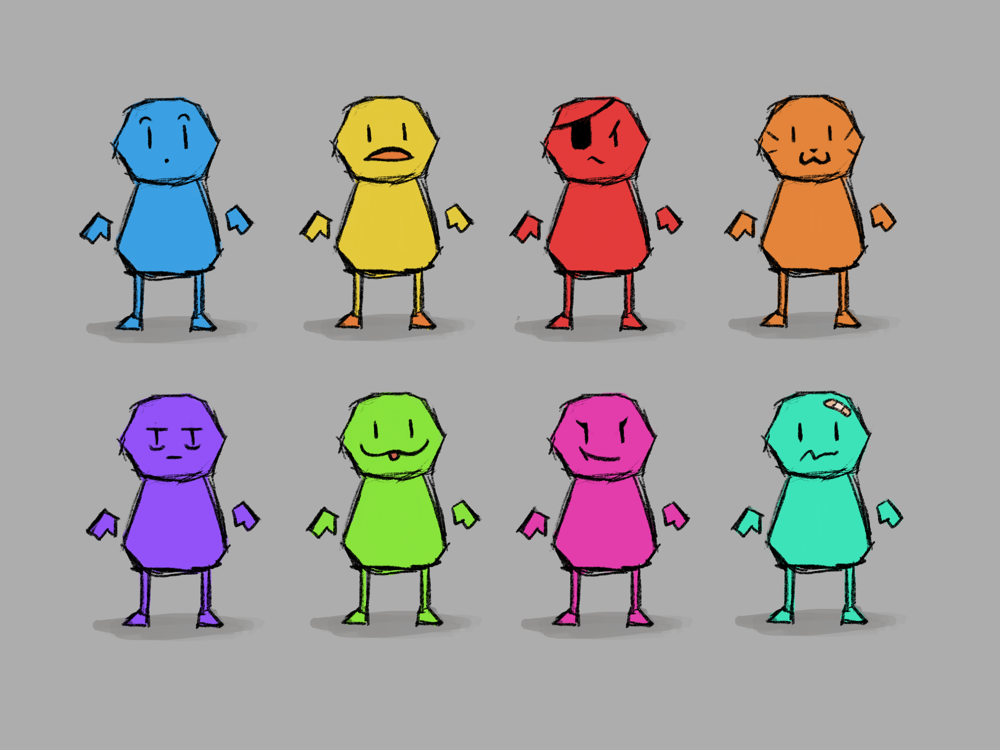

# Week X Report

<!-- add at least one of your latest screenshots to your group page -->

  <figure>
    
    <figcaption>
      8 little guys
    </figcaption>
  </figure>
  <figure>
    <video src="../../images/dev/first-wireframe.mp4" controls preload="none" poster="../../images/dev/first-wireframe-poster.png"></video>
    <figcaption>
      the camera is moving on the client side, and all the boxes are being moved on the server side. the server only moves everything at 25 fps which is why it looks choppy
    </figcaption>
  </figure>

## Group status

<!-- include both the week # and the date of the meeting -->

Meeting: [Sunday, May 12, 2024](#meeting-notes)

<!-- summarize your overall status for the week -->

<!-- add a statement summarizing the group morale (feel free to be creative in expressing your morale) -->

## Individual statuses

1. what were your concrete goals for the week?
1. what goals were you able to accomplish?
1. if the week went differently than you had planned, what were the reasons? note that this happens regularly...I would prefer you to be aggressive in what you want to try accomplish rather than limit yourself to goals you know you’ll easily achieve. so answering this question is more of a reflection on the development process and the surprises you encounter, it’s not at all an evaluation.
1. what are your specific goals for the next week?
1. what did you learn this week, if anything (and did you expect to learn it?)
1. what is your individual morale (which might be different from the overall group morale)?

### Nick

### Marcelo

### Tyler

### Killian

### Sean

### Will

### Kenzo

## Meeting notes

Present: Tyler, Marcelo, Sean, Nick

Excused: Will, Killian, Kenzo

> **Kenzo**: Yeah, we’re still figuring out how to take the vertices data from the buffer, we tried indexing the buffer but it gives us an error
>
> But will was able to take out the gltf parser from the client side and move it to the common folder so we can access it from the server side
>
> **Will**: Yea I have it working now where it can import and parse the sample map on the server
>
> Just need to finish testing that the collisions will work

- nick was distracted by new shiny thing instead of working on multiplayer
- tyler: did we ever manage to get camera stuff on the player?
  - no
- marcelo forgot what we were suppoosed to work on
  - tyler wrote them on the board
    - it's a todo list
  - need to fix the camera bug, map collisions (will & kenzo), multiplayer and cookies (sean & nick), interactions (tyler and marcelo)
    - sean wasnt working on multiplayer. he was just the original author, and helping nick modify it
- we split up to work on our parts
