# Week 7 Report

<!-- add at least one of your latest screenshots to your group page -->

  <figure>
    
    <figcaption>
      wood
    </figcaption>
  </figure>
  <figure>
    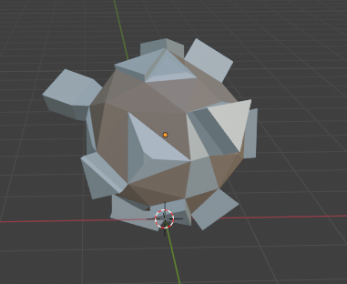
    <figcaption>
      raw iron
    </figcaption>
  </figure>
  <figure>
    
    <figcaption>
      iron
    </figcaption>
  </figure>
  <figure>
    
    <figcaption>
      mushroom
    </figcaption>
  </figure>
  <figure>
    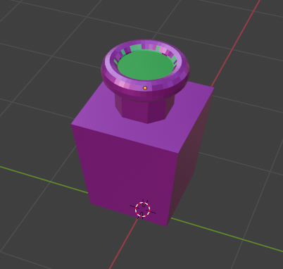
    <figcaption>
      magic sauce
    </figcaption>
  </figure>
  <figure>
    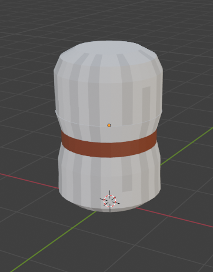
    <figcaption>
      string
    </figcaption>
  </figure>
  <figure>
    
    <figcaption>
      axe
    </figcaption>
  </figure>
  <figure>
    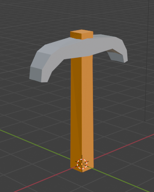
    <figcaption>
      pickaxe
    </figcaption>
  </figure>
  <figure>
    
    <figcaption>
      shears
    </figcaption>
  </figure>
  <figure>
    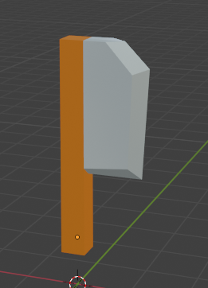
    <figcaption>
      knife
    </figcaption>
  </figure>
  <figure>
    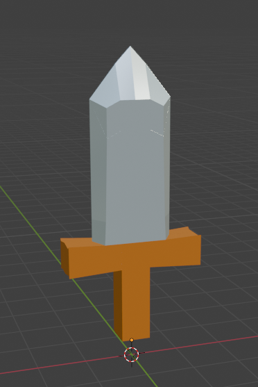
    <figcaption>
      sword
    </figcaption>
  </figure>
  <figure>
    
    <figcaption>
      gamer sword
    </figcaption>
  </figure>
  <figure>
    
    <figcaption>
      bow
    </figcaption>
  </figure>
  <figure>
    
    <figcaption>
      gamer bow
    </figcaption>
  </figure>

  <figure>
    
    <figcaption>
      set  max texture size to 32 this is what happened to fish
    </figcaption>
  </figure>
  <figure>
    <video src="../../images/dev/multiplayer1.mp4" controls preload="none" poster="../../images/dev/multiplayer1-poster.png"></video>
    <figcaption>
      attention gamers: behold: multiplayer:
    </figcaption>
  </figure>
  <figure>
    <video src="../../images/dev/multiplayer2.mp4" controls preload="none" poster="../../images/dev/multiplayer2-poster.png"></video>
    <figcaption>
      my obs died towards the end 😔
    </figcaption>
  </figure>
  <figure>
    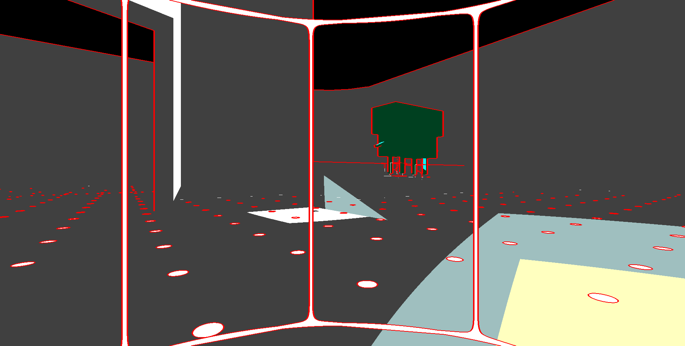
    <figcaption>
      they're stuck on the ramp
    </figcaption>
  </figure>
  <figure>
    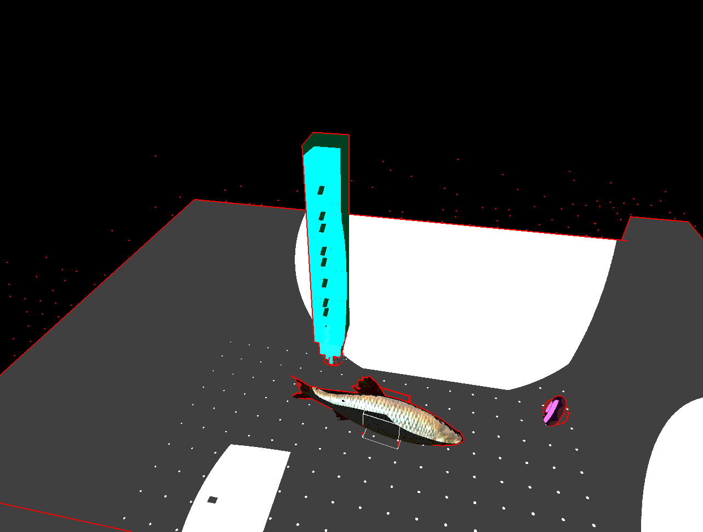
    <figcaption>
      those are players
    </figcaption>
  </figure>
  <figure>
    
    <figcaption>
      the ramp of doom
    </figcaption>
  </figure>
  <figure>
    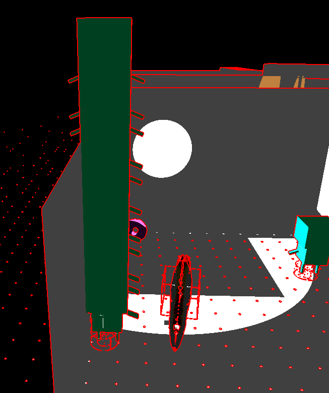
    <figcaption>
      the terrible tower
    </figcaption>
  </figure>
  <figure>
    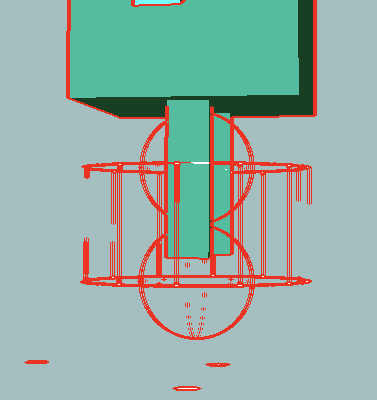
    <figcaption>
      wait we need to half the cylinder radius for the collider of the player
    </figcaption>
  </figure>
  <figure>
    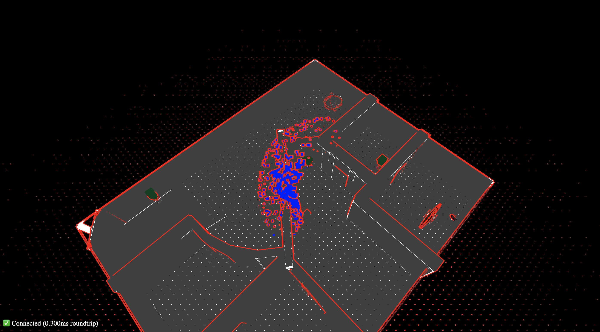
    <figcaption>
      Boss cam pov
    </figcaption>
  </figure>
  <figure>
    
    <figcaption>
      :o that's where the cylinder went
    </figcaption>
  </figure>
  <figure>
    
    <figcaption>
      how do i fix this again D:
    </figcaption>
  </figure>
  <figure>
    <video src="../../images/dev/multiplayer3.mov" controls preload="none" poster="../../images/dev/multiplayer3-poster.png"></video>
    <figcaption>
      Testing multiplayer at the Sunday meeting.
    </figcaption>
  </figure>
  <figure>
    <video src="../../images/dev/spawn-item.mp4" controls preload="none" poster="../../images/dev/spawn-item-poster.png"></video>
    <figcaption>
      you can now press X to spawn Killian's models. for some reason they sometimes disappear when you spawn another item
    </figcaption>
  </figure>
  <figure>
    
    <figcaption>
      I also haven't adjusted the sizes and positions of the models. omg i forgot to delete some of the other layers before exporting i just hid it im dead now we have mutant models my bad guys 😭😭😭 i totally forgot
    </figcaption>
  </figure>
  <figure>
    <iframe src="https://www.youtube.com/embed/W9U5Ez9gLIU" allow="accelerometer; autoplay; clipboard-write; encrypted-media; gyroscope; picture-in-picture; web-share" referrerpolicy="strict-origin-when-cross-origin" allowfullscreen></iframe>
    <figcaption>
      i fixed throwing
    </figcaption>
  </figure>
  <figure>
    
    <figcaption>
      hmm tones off looks kind of nice
    </figcaption>
  </figure>
  <figure>
    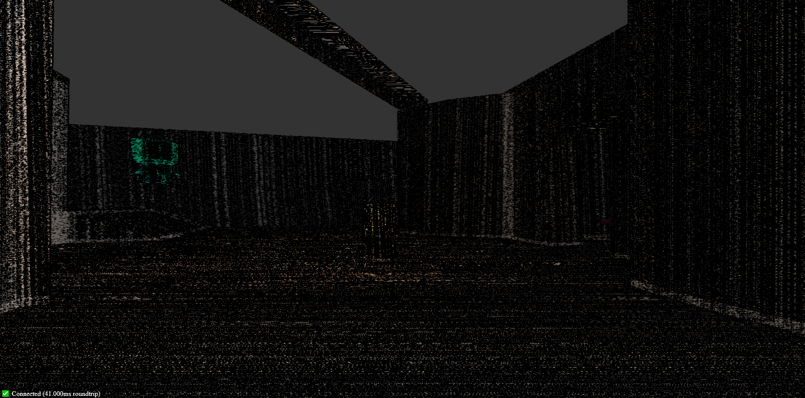
    <figcaption>
      our game has an epileptic mode where instead of prevent epilepsy it induces it
    </figcaption>
  </figure>
  <figure>
    
    <figcaption>
      fhis
    </figcaption>
  </figure>

## Group status

<!-- include both the week # and the date of the meeting -->

Meeting: [Sunday, May 19, 2024](#meeting-notes)

<!-- summarize your overall status for the week -->

We added multiplayer, item models, the ability to throw items, a recipe system, and the boss. We switched our map to use boxes instead of a trimesh, and movement now feels a lot nicer overall.

Next week, we need to:

- Add game phases
- Create a spawner entity
- Design the map
- Boss sabotage

Here are the things that we need to work on in general:

- A timer and UI
- Creation/deletion queues
- Win condition
- Sound effects
- Models for the crafting stations
- Update the map
- Test the game!

<!-- add a statement summarizing the group morale (feel free to be creative in expressing your morale) -->

We're actually pretty excited about finishing the project!

## Individual statuses

### Nick

MY goals for last week were to get multiplayer working! The other ones were not concrete 🤓

Lo and behold,,, it is now working! WOW! Amazing. Sean offered some help making my implementation of the server less dumb, and we worked it out really well so not it is squeaky clean! This is about all I did this week before getting absorbed into the abyss of other work and activities.

The week went by how I planned. I still didn't LOCK IN as hard as I would have liked, but that's just how it goes sometimes. I do want to lock in harder this week, but there's a lot I've got going on which is going to make that hard. In spite of that I still want to get a lot done.

Next week I want to make player grabbing items not rotate the items in your hand (find a way to make the held item static). I want to spend a shorter amount of time tuning the movement so it feels less floaty (this can be a massive time sink fiddling with movement so I'm planning on keeping it short but also I feel it is really necessary to tune, because right now it feels blegh). I need to fix some bugs with duplicate entity IDs and keeping them separate in the physics engine, and I need to remove the testing physics objects. I also need to start either sending model offsets from the server when specifying objects, or the client needs to just know that certain objects have certain model offsets. If all of that gets done and no one else has started working on it yet, I'd be interested in working on using the WebAudio API to make sound effects play at coordinates in game. For example if there is an item pick-up noise, then sending a pick-up event to all clients for them to play a sound there.

I didn't really learn anything too new this week, but I did learn the value of sanity-checking implementations and explaining code to justify its existence and implementation.

I'm alright, tired, terrible sleep schedule, but i'd give my morale a solid 8/10. I want to do a lot of things but actually doing them is hard.

### Marcelo

1. what were your concrete goals for the week?

   GAME PHASES WE NEED IT, also build a fun way for players to interact with items and crafting and stuff

1. what goals were you able to accomplish?

   picking up and throwing items work-ish. Discuss the important todos for the future such as how the phases would look like and how the boss would interact in the early phase of the game

1. if the week went differently than you had planned, what were the reasons? note that this happens regularly…I would prefer you to be aggressive in what you want to try accomplish rather than limit yourself to goals you know you’ll easily achieve. so answering this question is more of a reflection on the development process and the surprises you encounter, it’s not at all an evaluation.

   I hoped to get the game phases down this week but i underestimated how much planning we needed to do for it. We just finished the multiplayer connections and stuff.

1. what are your specific goals for the next week?

   GAME PHASES WE NEED IT AHHHHHHHHHHHHHHHHHHHHH

1. what did you learn this week, if anything (and did you expect to learn it?)

   I learned about the gist of creating multiplayer connections as well as some physical interactions of cannon-es

1. what is your individual morale (which might be different from the overall group morale)?

   A little excited as we officially reached the point of no return for our game

### Tyler

1. what were your concrete goals for the week?

   My concrete goals for the week were to:

   1. Finish the recipe system
   2. create some model-less crafting tables and test that they work with a variety of resources
   3. create a small variety of resources
   4. Maybe have the white box test complete, so we can all play the game together? that would be really cool

2. what goals were you able to accomplish?

   The recipe system is fully finished, all resources are able to be modularly created, I tested that they work (they do), and created a creation and deletion system to make deleting and creating items smoothing and without game breaking bugs!

   also did a small smidgen of work on like models n stuff.

   We got some basic white box testing! We were all able to get on and fuck around with it in 3D, which is great.

3. if the week went differently than you had planned, what were the
   reasons? note that this happens regularly...I would prefer you to
   be aggressive in what you want to try accomplish rather than limit
   yourself to goals you know you'll easily achieve. so answering
   this question is more of a reflection on the development process
   and the surprises you encounter, it's not at all an evaluation.

   Things went wonderfully tbh. Finally pushed myself out of the slump and we're back in it

4. what are your specific goals for the next week?

   1. Iron out a bug or two in the creation system
   2. Create a spawner class (should be so simple)
   3. bug fixes! We've got a list now

5. what did you learn this week, if anything (and did you expect to learn it?)

   I don't know that I learned a ton?

   I managed to get a good amount of work done which is good!

   I'm much more comfortable with tyepscript now, and I'm able to actually create in the system without pair programming.

6. what is your individual morale (which might be different from the
   overall group morale)?

   9/10, regarding the project! We're definitely going to finish in time. We're a little sad that we won't be able to actually create a combat system, which is definitely annoying, but we are going to have a workable product super soon, I know it.

### Killian

1. My concrete goals for this week was to make all the weapons, craftable items, and resources for the game.

2. This week I was able to finish the weapons, resources, and most of the craftable items, with the exception of the armor.

3. For this week, I mostly met my goals from last week except for the armor.

4. Next week, I want to focus on designing a finalize version of the map so when I get back from my trip I can model it.

5. Like last week, I've also gotten more comfortable with the Blender workflow and am able to make models a little faster.

6. I feel alright this week since I mostly accomplished my goal. However, I’m a little nervous for taking a week off from modeling for my trip since we’re getting close to the deadline.

### Sean

Last week, I set out to accomplish the following goals:

- > Add the ability to throw objects. To me, this is very important since it’s what makes physics engines so fun.

  I did it!

- > Create a spawner entity that just spawns more entities. Tyler wanted this, and I think this will help with playing around with picking up and throwing objects.

  I didn't implement this. I think Tyler can work on this.

In addition, I also finaly implemented multiplayer with Nick over VC 🎉, so now multiple devices each get their own player entity. I think we've finally crossed a major milestone here. I've also adjusted throwing to actually throw objects, so the game feels a lot more interactive than it was before.

I also [made several other changes](https://github.com/ucsd-cse125-sp24/group1/commits/main/?author=SheepTester&since=2024-05-13&until=2024-05-20):

- Added the ability to scale individual models of an entity.

- Nick's Firefox had a texture size limit smaller than the `fish1` model's texture, so I made it shrink textures if they're too large for the device.

- Fixed jumping twice (because someone broke it after I fixed it the first time). Our raycaster was selecting an arbitrary object in its path, rather than the closest object.

- Added several more debug keys: `K` to cycle between wireframe views, `B` and `N` to switch between boss and hero roles, `X` to spawn a random item, and `T` to toggle cell shading.

- On Android, you can tap the screen to enter fullscreen landscape mode.

- Added a controls guide screen that doubles as controls for touch users.

- The server currently can produce phantom entities, and I was colliding into invisible objects even though I couldn't see their wireframes. This was because the current `Entity` system relies on each subclass to properly serialize their shapes. I refactored this to make wireframes read from the physics world directly, so any wireframes without an associated model is an indication of a phantom model.

- Added Killian's models into the game.

- Fixed the camera position for the player, so selecting and picking up items is now possible again.

- Adjusted the graphics so the point lights aren't just white circles anymore. Disabling cell shading seems to look nicer now.

From debugging jumping, I learned more about the structure of the server codebase. I was more productive than I expected because my midterms and SDCTF are over. I am pretty motivated to continue working on the game, but I'm a bit concerned that my midterms will make my final crunch week busy.

My goals for next week are based on what currently bothers me while playing our game.

- Adjust the model positions and sizes. Right now, the players are all floating off the ground. I think I will add a camera offset option for locking cameras to entities so that the origin point of player entities is at the foot level, which is how the player model is currently anchored.

- Debug why shadows seem a bit broken. Perhaps I can also figure out why lighting doesn't really work on Android.

- It's currently hard to tell who's who. I should add name tags to players.

  - Rendering text in-game would be useful for showing the status of crafters and such.

Then towards implementing actual gameplay:

- Create a simple UI widget for the timer and define the message format to allow the server to set the timer for a client.

- Use Tyler's crafting system to detect recipes and produce outputs.

- I think that combat is possible to implement, though it might not be well fleshed out, since it'll be fairly similar to picking up items. I want to try adding the ability to hit other players, and maybe apply some knockback.

### Will

1. Revamp map collision to use boxes instead of a triangle mesh (because the cannon.js Trimesh only collided with spheres and was easy to clip through), revamp player movement to feel better.

2. I updated our server-side map parsing algorithm to generate a list of Box shapes instead of one Trimesh shape for map collision. This requires a special collider model separate from the map model itself. It should be pretty easy to quickly make one in the same Blender file or perhaps we can find a way to generate it automatically. I then rewrote our player movement code to apply impulses instead of forces, which feels a lot nicer to play (and closer to other games). I also fixed a couple minor issues such as not updating the look direction server-side until a new input event.

3. Things generally went according to plan this week. I said that last week and then had to rewrite the map colliders, so maybe next week we’ll find some game breaking problem with the movement code.

4. My goal for next week is to work on the boss experience. Specifically, figure out how the boss player will actually control the boss—this might require us to return the boss to first-person instead of the top-down perspective it currently has, given the ways we want the boss to interact with other entities. Along with that I will actually implement some of those interactions. If I have time, I might also try to implement the QTE in the second stage which will stand in for an actual boss fight if we don’t complete it.

5. I didn’t really learn anything that I can recall. I guess I saw why most games probably have a custom character controller that doesn’t rely on the physics engine for movement.

6. Still feeling pretty good. On Sunday four of us got on the demo server and jumped around, which both showed that we now have something tangible and revealed several issues which we then fixed. I do hope that we can get an actual combat stage by the demo day.

### Kenzo

1. what were your concrete goals for the week?

   My concrete goals for the week is to implement the Boss entity.

1. what goals were you able to accomplish?

   I was able to implement the boss entity file where the hit boxes of the boss is smaller than the player and it moves faster. Then the boss entity also has a top down pov that allows the boss player to oversee the map while moving.

1. if the week went differently than you had planned, what were the reasons? note that this happens regularly…I would prefer you to be aggressive in what you want to try accomplish rather than limit yourself to goals you know you’ll easily achieve. so answering this question is more of a reflection on the development process and the surprises you encounter, it’s not at all an evaluation.

   At first my plan is to implement the collision of the map but it was taken care by William, so I changed my goal for the week which is to implement the boss entity, but I think this week went well.

1. what are your specific goals for the next week?

   My goals for next week is to implement the interaction between the boss and the player where the boss can blind the player.

1. what did you learn this week, if anything (and did you expect to learn it?)

   I learned more about the networking code and I found out that by doing the code instead of just looking it I was able to understand more.

1. what is your individual morale (which might be different from the overall group morale)?

   I am excited to see how our games will go in the next few weeks, kinda nervous because there are a lot of things to do, but we are almost there!

## Meeting notes

Present: Marcelo, Tyler, Will, Kenzo

Absent: Sean, Nick

On trip: Killian

_No meeting notes available this week._

  <figure>
    
  </figure>
  <figure>
    
  </figure>
  <figure>
    
  </figure>
  <figure>
    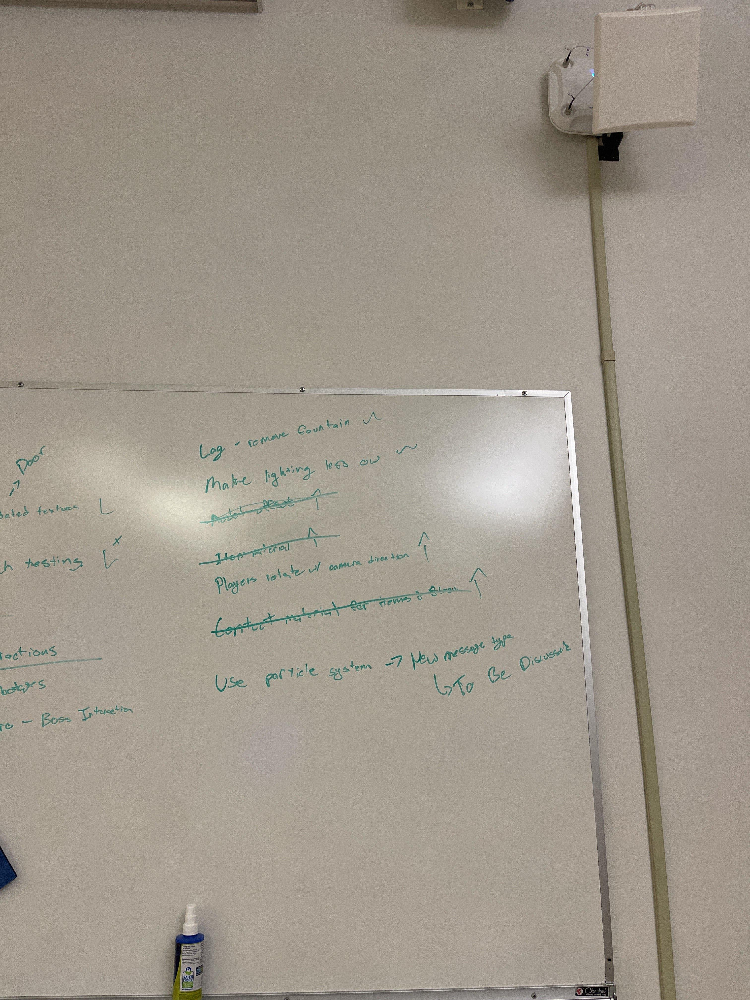
  </figure>

