# Week X Report

<!-- add at least one of your latest screenshots to your group page -->

  <figure>
    
    <figcaption>
      sean and i got covid from marcelo 💀
    </figcaption>
  </figure>
  <figure>
    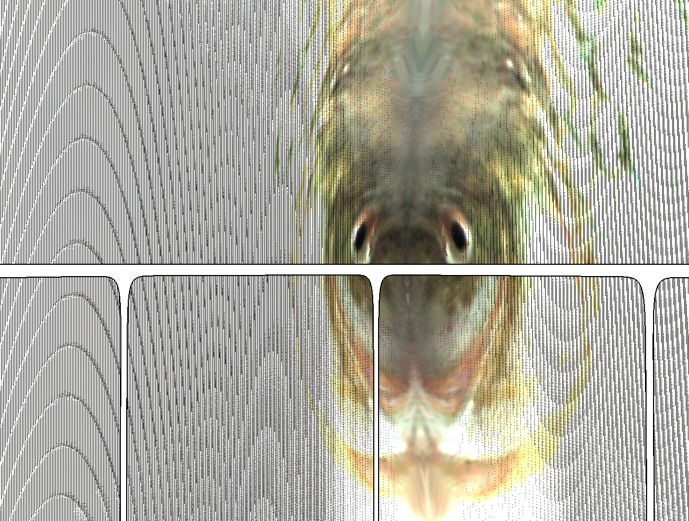
    <figcaption>
      fish
    </figcaption>
  </figure>
  <figure>
    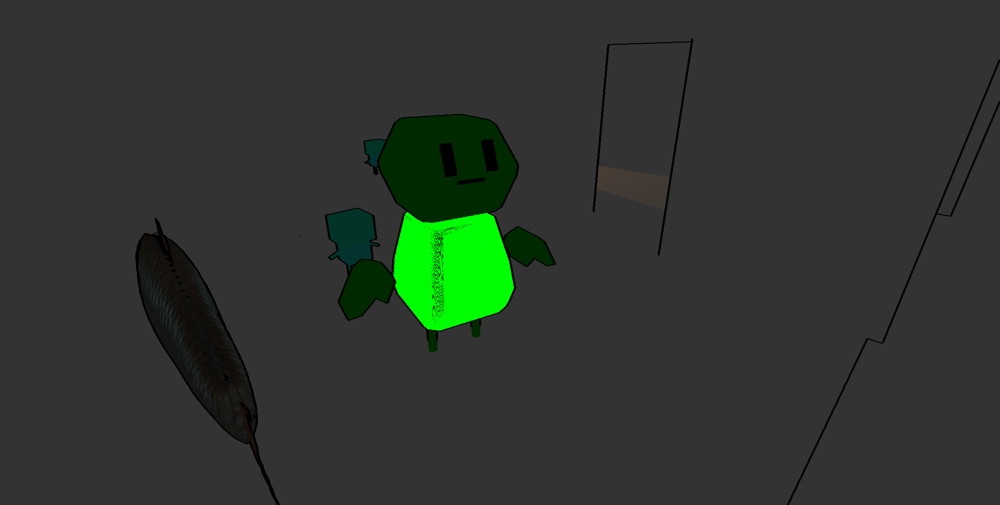
    <figcaption>
      he swallowed the light
    </figcaption>
  </figure>
  <figure>
    <video src="../../images/dev/crafting.mp4" controls preload="none" poster="../../images/dev/crafting-poster.png"></video>
    <figcaption>
      crafting?
    </figcaption>
  </figure>
  <figure>
    <video src="../../images/dev/sound.mp4" controls preload="none" poster="../../images/dev/sound-poster.png"></video>
    <figcaption>
      i added sound effects
    </figcaption>
  </figure>
  <figure>
    <video src="../../images/dev/nick-gameplay.mp4" controls preload="none" poster="../../images/dev/nick-gameplay-poster.png"></video>
    <figcaption>
      Nick and Sean test out the gameplay with the new sound effects
    </figcaption>
  </figure>
  <figure>
    <video src="../../images/dev/meeting-gameplay.mp4" controls preload="none" poster="../../images/dev/meeting-gameplay-poster.png"></video>
    <figcaption>
      We test out the gameplay during our meeting
    </figcaption>
  </figure>
  <figure>
    <video src="../../images/dev/subset-gameplay-1.mp4" controls preload="none" poster="../../images/dev/subset-gameplay-1-poster.png"></video>
    <figcaption>
      More gameplay testing
    </figcaption>
  </figure>
  <figure>
    <video src="../../images/dev/subset-gameplay-2.mp4" controls preload="none" poster="../../images/dev/subset-gameplay-2-poster.png"></video>
    <figcaption>
      Item hitting sounds
    </figcaption>
  </figure>
  <figure>
    <video src="../../images/dev/nick-glitch.mp4" controls preload="none" poster="../../images/dev/nick-glitch-poster.png"></video>
    <figcaption>
      How the game appears on Nick's PC
    </figcaption>
  </figure>
  <figure>
    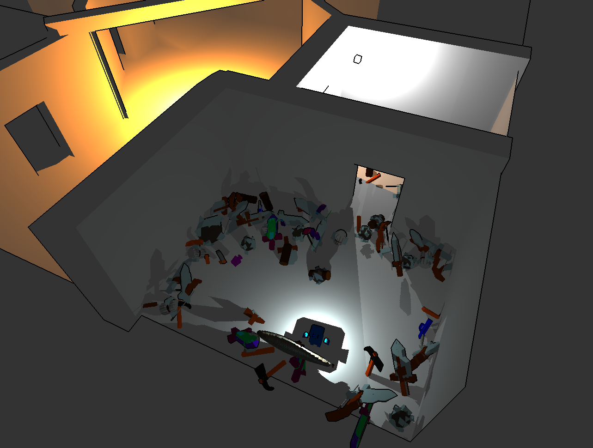
    <figcaption>
      it is not as laggy anymore with more items
    </figcaption>
  </figure>
  <figure>
    
    <figcaption>
      this happens when i ctrl w and ctrl shift t
    </figcaption>
  </figure>
  <figure>
    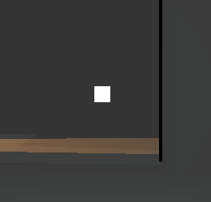
    <figcaption>
      commenting out the code that makes it a circle makes it render for me
    </figcaption>
  </figure>
  <figure>
    
    <figcaption>
      `gl_PointCoord` is supported on my gpu though hmm
    </figcaption>
  </figure>
  <figure>
    
    <figcaption>
      i'm not sure what v_ttl's value is because for some reason it's either >= 1.0 or <= 1.0 but it is neither >= 1.0 nor <= 1.0 ?? oh it's probably because the compiler is optimizing it
    </figcaption>
  </figure>
  <figure>
    
    <figcaption>
      fixed it!
    </figcaption>
  </figure>
  <figure>
    <video src="../../images/dev/transition.mp4" controls preload="none" poster="../../images/dev/transition-poster.png"></video>
    <figcaption>
      animated transitions!
    </figcaption>
  </figure>
  <figure>
    
    <figcaption>
      hoo boy that's a bug
    </figcaption>
  </figure>
  <figure>
    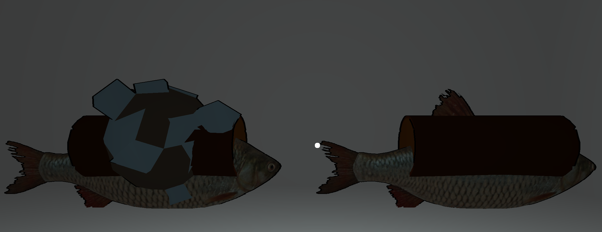
    <figcaption>
      also when an item goes into a crafting table the model for the crafting table somehow adds the item??
    </figcaption>
  </figure>

## Group status

<!-- include both the week # and the date of the meeting -->

Meeting: [Sunday, May 26, 2024](#meeting-notes)

<!-- summarize your overall status for the week -->

<!-- add a statement summarizing the group morale (feel free to be creative in expressing your morale) -->

## Individual statuses

1. what were your concrete goals for the week?
1. what goals were you able to accomplish?
1. if the week went differently than you had planned, what were the reasons? note that this happens regularly...I would prefer you to be aggressive in what you want to try accomplish rather than limit yourself to goals you know you’ll easily achieve. so answering this question is more of a reflection on the development process and the surprises you encounter, it’s not at all an evaluation.
1. what are your specific goals for the next week?
1. what did you learn this week, if anything (and did you expect to learn it?)
1. what is your individual morale (which might be different from the overall group morale)?

### Nick

### Marcelo

### Tyler

### Killian

### Sean

  <figure>
    
    <figcaption>
      oh there appears to be gaps between the faces of the shadow cubemap. i disabled shadows but you can see the square outlines underneath each light source
    </figcaption>
  </figure>
  <figure>
    
    <figcaption>
      i wonder why the shadows arent being casted in those directions. actually i think it happens on all sides except along the edges of the cube which is weird
    </figcaption>
  </figure>
  <figure>
    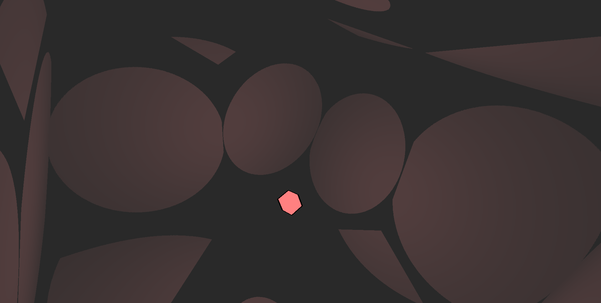
    <figcaption>
      this is a red point light casting phantom shadows onto a rotated cube
    </figcaption>
  </figure>
  <figure>
    
    <figcaption>
      and this is when it's not rotated
    </figcaption>
  </figure>
  <figure>
    
    <figcaption>
      `shadow_dist < distance - 0.005` means there's a shadow, but there's a mysterious square shadow underneath point lights
    </figcaption>
  </figure>
  <figure>
    
    <figcaption>
      red: `shadow_dist / distance`
    </figcaption>
  </figure>
  <figure>
    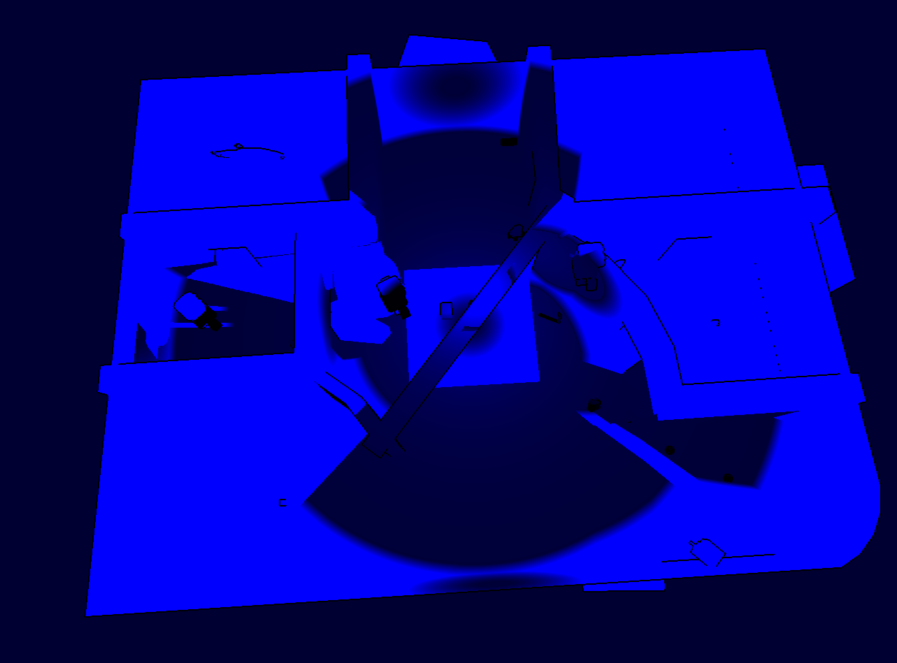
    <figcaption>
      blue: `distance - shadow_dist`
    </figcaption>
  </figure>
  <figure>
    
    <figcaption>
      these cube map things are making me feel like i'm looking at fnaf surveillence footage
    </figcaption>
  </figure>
  <figure>
    
  </figure>
  <figure>
    
  </figure>
  <figure>
    
  </figure>
  <figure>
    
  </figure>
  <figure>
    
    <figcaption>
      hmm
    </figcaption>
  </figure>
  <figure>
    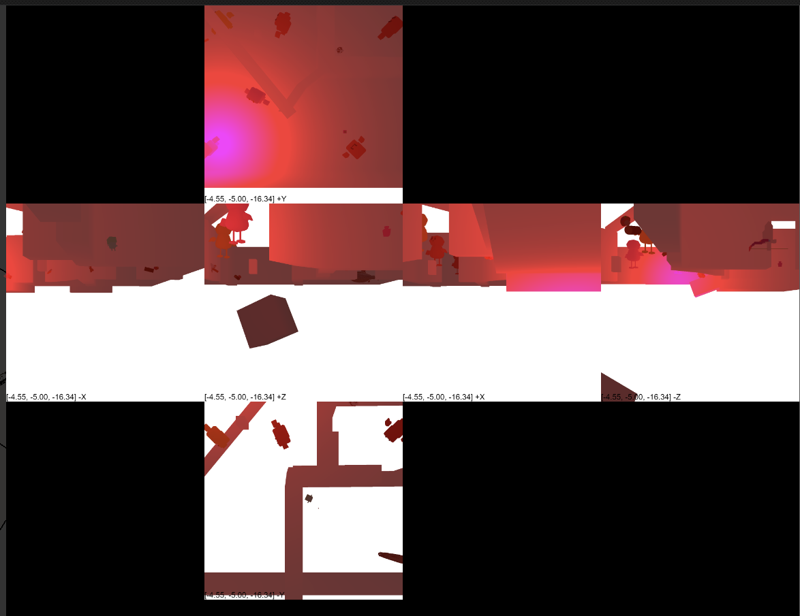
  </figure>
  <figure>
    
    <figcaption>
      now it thinks everything is a shadow (except for some weird artifacts along the axes)
    </figcaption>
  </figure>
  <figure>
    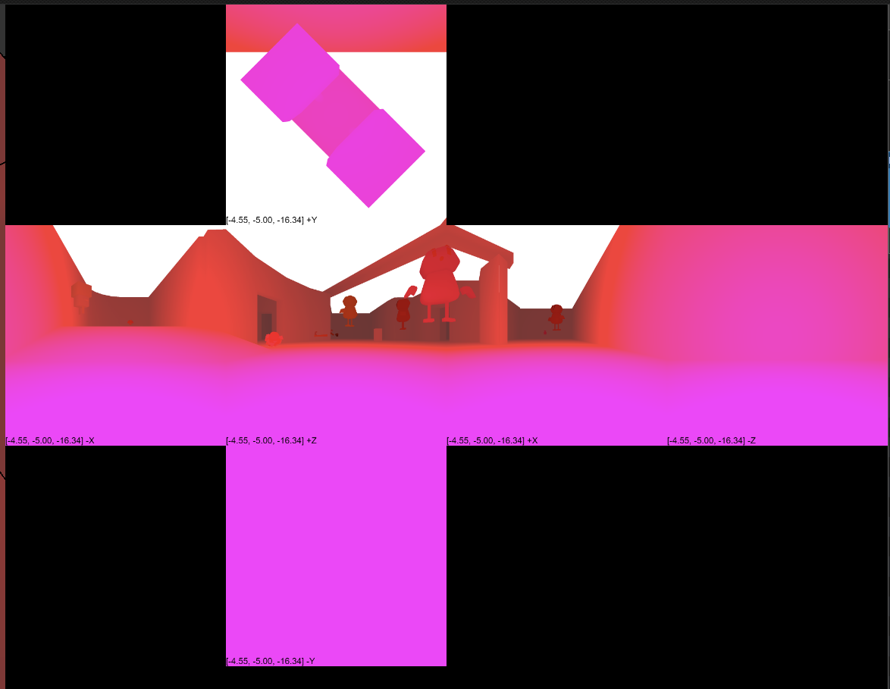
    <figcaption>
      setting the FOV to 90° rather than 45° makes the cube map look more correct
    </figcaption>
  </figure>
  <figure>
    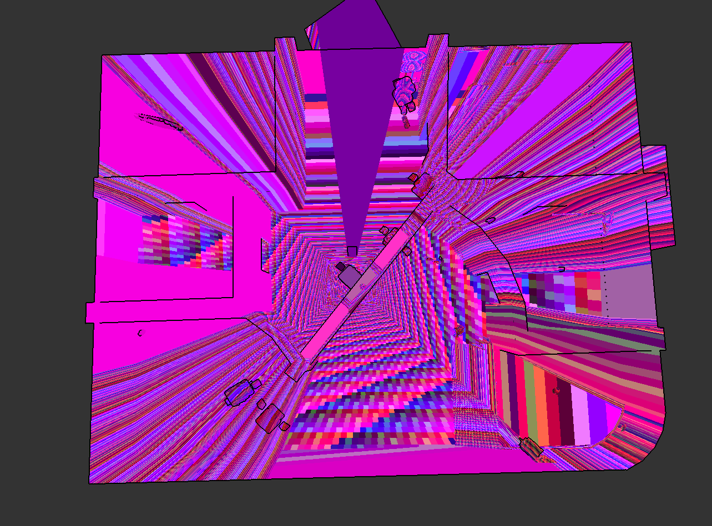
    <figcaption>
      making every distinct depth value a different color to see what the limits of precision are
    </figcaption>
  </figure>
  <figure>
    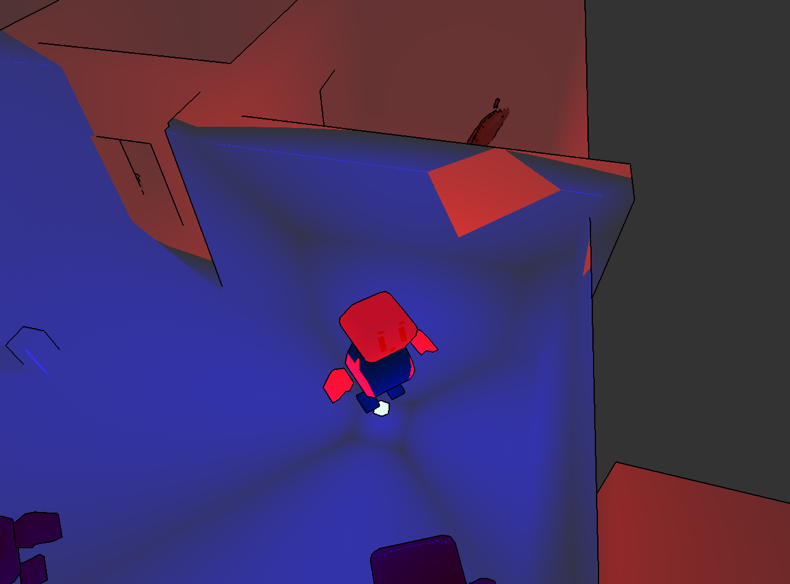
  </figure>
  <figure>
    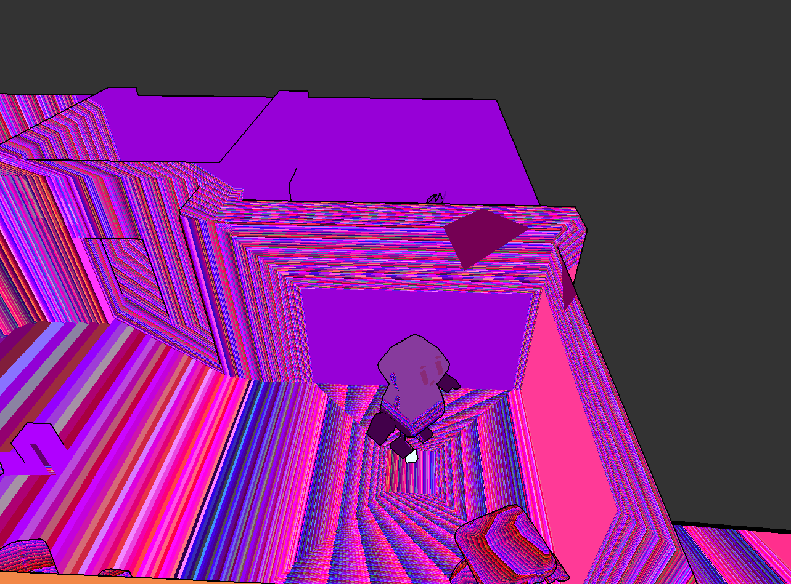
  </figure>
  <figure>
    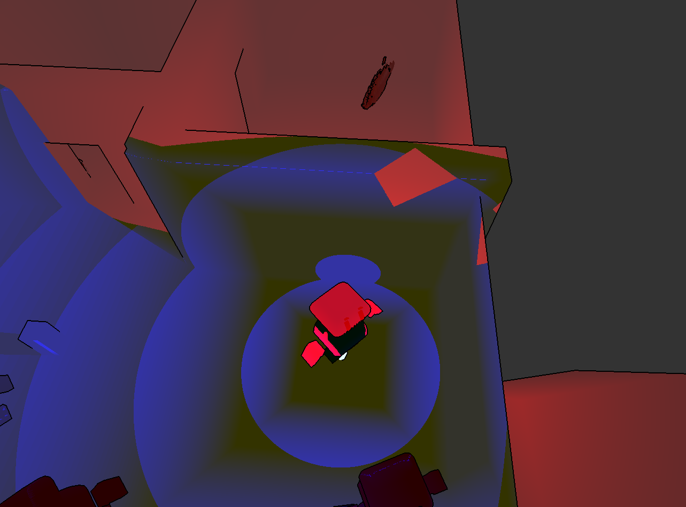
  </figure>
  <figure>
    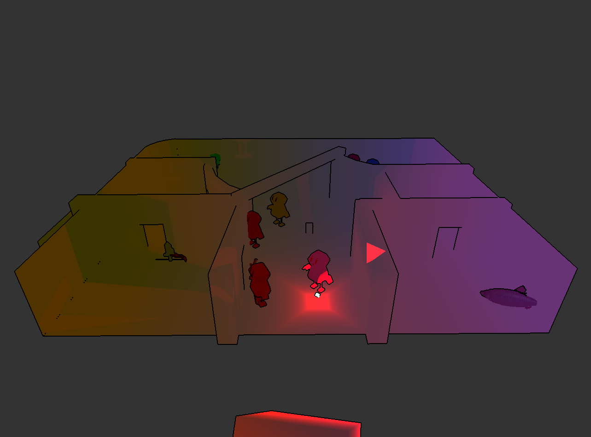
    <figcaption>
      v_position
    </figcaption>
  </figure>
  <figure>
    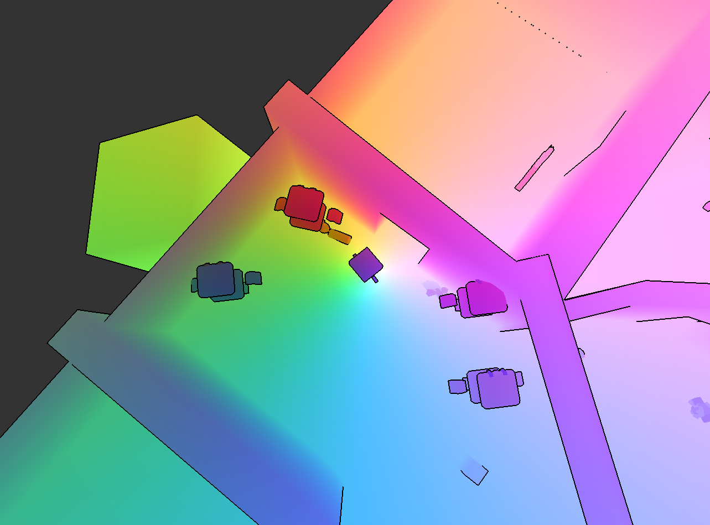
    <figcaption>
      accidental acm
    </figcaption>
  </figure>
  <figure>
    
    <figcaption>
      dowhep
    </figcaption>
  </figure>
  <figure>
    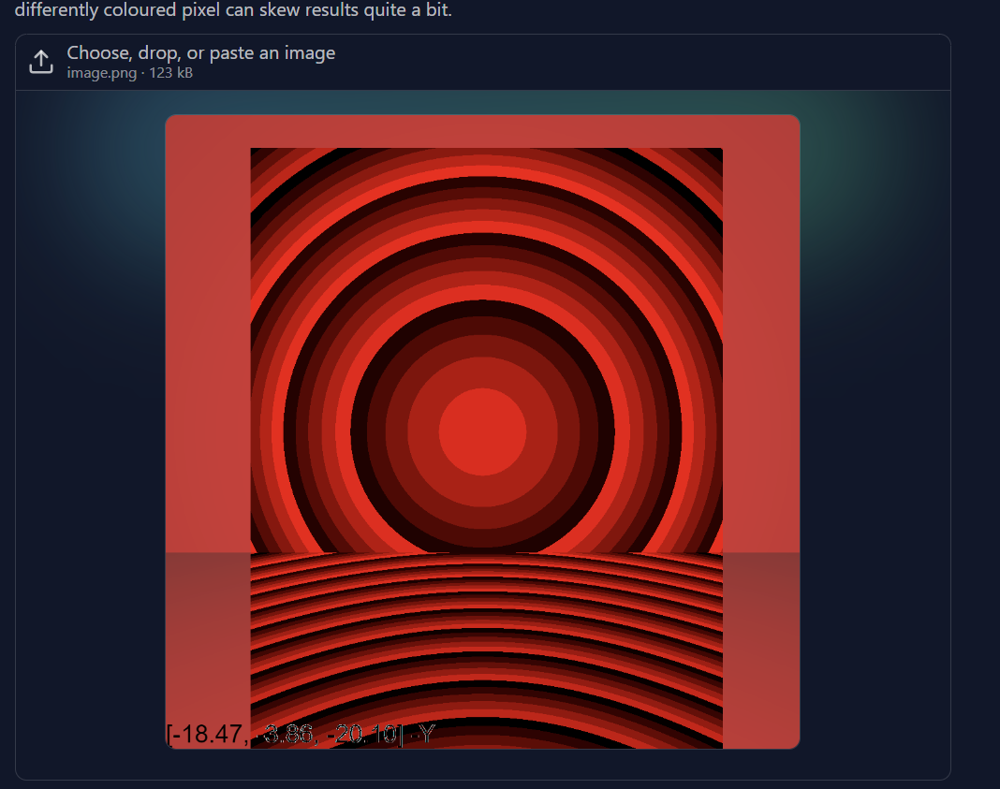
  </figure>
  <figure>
    
    <figcaption>
      Oh I think shadows are a bit broken along the axes because the depth values from the texture cube are kind of like Manhattan distance than Euclidean distance
    </figcaption>
  </figure>
  <figure>
    
    <figcaption>
      the issue right now is that the light can sometimes travel through walls
    </figcaption>
  </figure>
  <figure>
    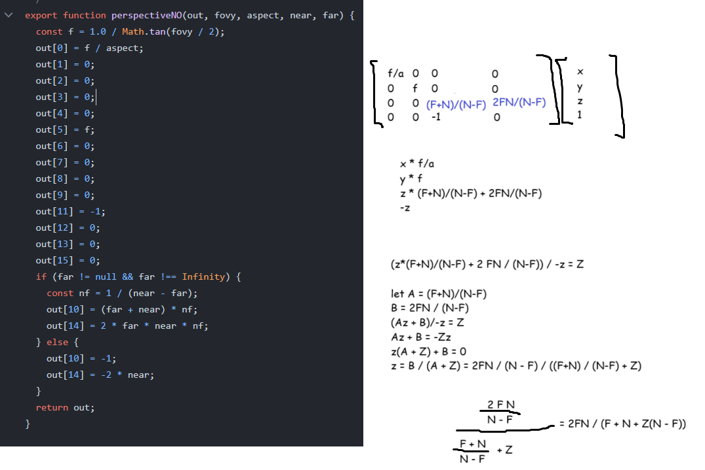
  </figure>
  <figure>
    
    <figcaption>
      before
    </figcaption>
  </figure>
  <figure>
    
    <figcaption>
      after
    </figcaption>
  </figure>
  <figure>
    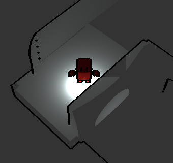
    <figcaption>
      before
    </figcaption>
  </figure>
  <figure>
    
    <figcaption>
      after
    </figcaption>
  </figure>
  <figure>
    
    <figcaption>
      depth buffer (shadow map) / calculated z
    </figcaption>
  </figure>
  <figure>
    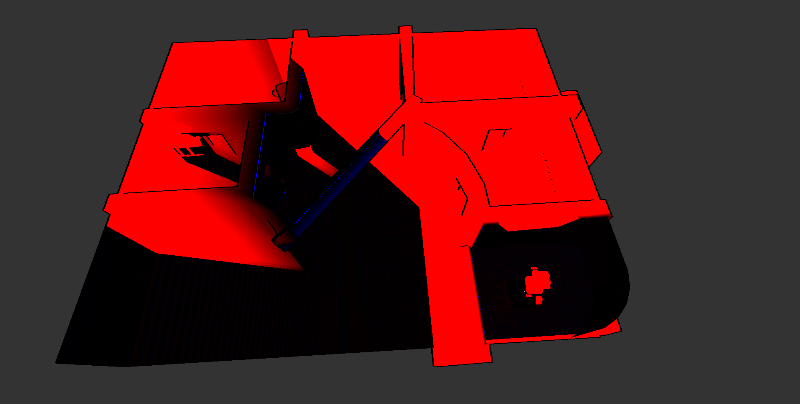
  </figure>
  <figure>
    <video src="../../images/dev/shadow/thru-wall.mp4" controls preload="none" poster="../../images/dev/thru-wall-poster.png"></video>
    <figcaption>
      the solution was to copypaste from stackoverflow
    </figcaption>
  </figure>

### Will

### Kenzo

## Meeting notes

Today's meeting was moved online because four of us are sick.

Present: Sean, Tyler, Will, Kenzo, Killian

- it's week 9. two weeks left. no playable demo yet. probably no combat
  - sean: currently there's punching, but that's probably more sabotage than combat
  - for combat, we'd need inventory, potions, armor, bows, which can't rotate in your hand
  - need big boss model, crafting table models
- we need: win condition, new map and that's it
  - and playtest
    - hard to select items
- models a little scuffed
  - need to give each item a different collider
- rn there are sound effects,
  - marcelo said he wanted to. not sure where he's been
    - he's playing minecraft
- game is a bit laggy
  - probably with many items/meshes
- playtesting
  - sound effects are funny
  - we have spawner now, but it's buggy (need to throw axe at it but it currently works without it)
    - player collisions also spawn item
  - hit reach distance is very far
  - lag is an issue
  - kenzo's PC has same issue as Nick's, with weird buggy rendering
  - reticle not being rendered
  - crafters work, spawners work
  - standing on players/crafters makes you really slow, and can't jump on players
  - need timer
  - options menu, an actual UI
    - mouse sensitivity
- killian: do we need big/little boss
  - not as important. just need crafting models (furnace and crafting table and potion station)
    - forest for wood
    - ore vein for ore
    - spiderwebs for string
    - mushrooms
    - crafting stations: anvil for making knife, sword, armor, ingot. bow and magic sauce at their own tables. furnace to combine wood + ore for ingot
- killian: map idea for two levels:
  - top level is abandoned living area: crafters and wood source (forest/broken furniture)
  - lower level is darker, abandoned work area: mushrooms, iron, spiderweb
  - tyler: have holes from top to bottom, can throw items down and accidentally fall. and prevents people from clashing with e/o on the stairs
  - tyler: need to double size of the map
    - killian: will make upper level larger
  - tyler: need menu/UI for showing tutorial page
- divy up work instead of making it free-for-all
  - sean: performance
  - will: win condition, fix crosshair
  - kenzo: still trying to work on blind sabotage, unsure how to move camera
    - will already did that. boss can spore player to reduce vision
    - tyler: just keep what you're doing
  - we need particles
    - can implement it like sound. server plays particles at position, `this.game.playParticle`
  - combat could be free for all since it's not MVP
    - will could do it soon
  - tyler: fix spawner, populate crafters. after that, implement combat, like sword or bow shoot arrows
- tyler: doesn't seem like people are passionate about this anymore. it's week 9. some people have been absent
  - will: people are sick
- marcelo and nick not here. cringe
- can playtest on tuesday. game is at playtestable state
- will tried to fix reticle but still doesn't work. sean might work on it since will can't reproduce it
- killian will be back in SD tomorrow

Summary of to-do items:

- Crafter models (Killian)
- Detailed map (Killian)
- Performance (Sean)
- Win condition (Will)
- Fix crosshair (Will)
- Playing particles
- Combat (Will? Tyler?)
- Fix spawner (Tyler)
- Populate crafters in map (Tyler)
- Sound effects and music (Marcelo)
