# Week 9 Report

<!-- add at least one of your latest screenshots to your group page -->

  <figure>
    
    <figcaption>
      Fixed the issue! It was because we were discarding pixels if the alpha value is less than 1, and on the PCs sometimes the values get slightly less than 1
    </figcaption>
  </figure>
  <figure>
    
    <figcaption>
      i will add a way to render text so we can add name tags to players
    </figcaption>
  </figure>
  <figure>
    
    <figcaption>
      Can it render emojis lol. currently no because i wasn't sure how to prevent the linear magfilter (which looks nicer than nearest neighbor) from interpolating the color with the transparent black
    </figcaption>
  </figure>
  <figure>
    
    <figcaption>
      A player with a name tag
    </figcaption>
  </figure>
  <figure>
    
    <figcaption>
      it looks like the lvl 1 lvl 99 boss videos
    </figcaption>
  </figure>
  <figure>
    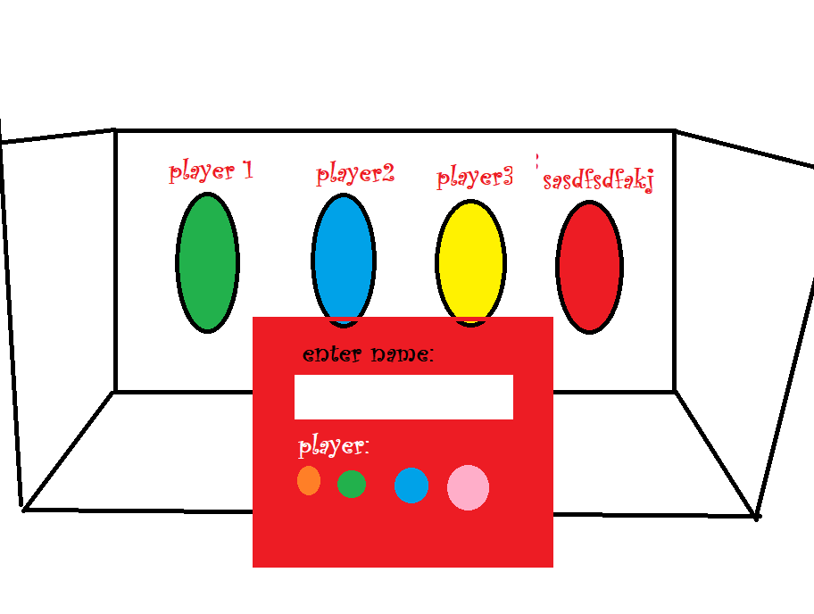
    <figcaption>
      i was thinking something like this for the lobby\ where this is where you're put when waiting to join a game. the box is a waiting room where you can see everyone else you're playing with and what color player they are and their names
    </figcaption>
  </figure>
  <figure>
    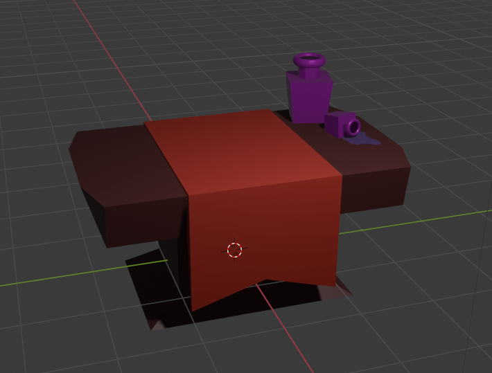
    <figcaption>
      bottle_table
    </figcaption>
  </figure>
  <figure>
    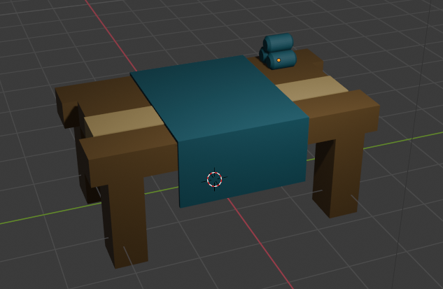
    <figcaption>
      this is the one bows and (maybe) armor
    </figcaption>
  </figure>
  <figure>
    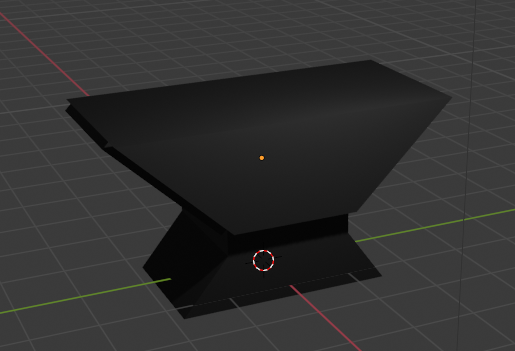
    <figcaption>
      anvil
    </figcaption>
  </figure>
  <figure>
    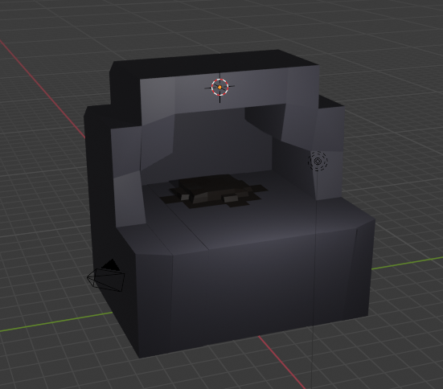
    <figcaption>
      furnace
    </figcaption>
  </figure>
  <figure>
    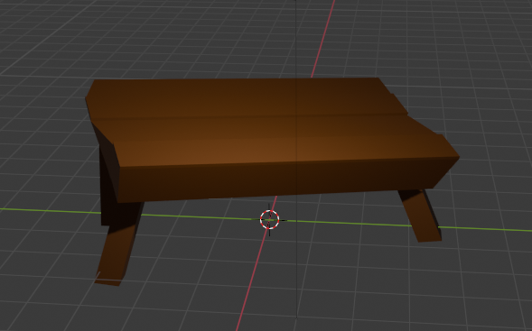
    <figcaption>
      table
    </figcaption>
  </figure>
  <figure>
    
    <figcaption>
      chair
    </figcaption>
  </figure>
  <figure>
    
    <figcaption>
      ore_vein
    </figcaption>
  </figure>
  <figure>
    
    <figcaption>
      spider_web
    </figcaption>
  </figure>
  <figure>
    
    <figcaption>
      mushroom_cluster
    </figcaption>
  </figure>
  <figure>
    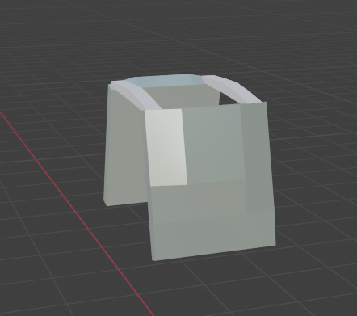
    <figcaption>
      armor
    </figcaption>
  </figure>
  <figure>
    
    <figcaption>
      mushroom_guy
    </figcaption>
  </figure>
  <figure>
    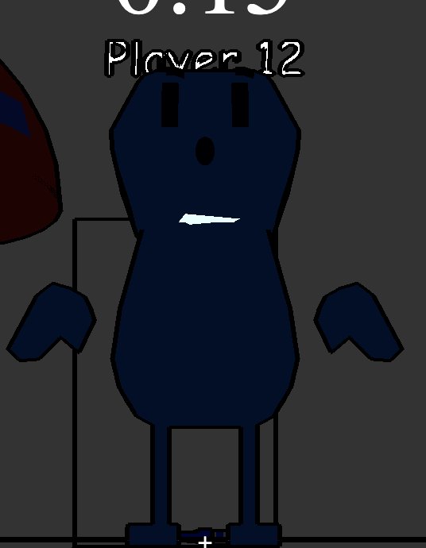
    <figcaption>
      I think i put the particle system on the person's neck lol
    </figcaption>
  </figure>
  <figure>
    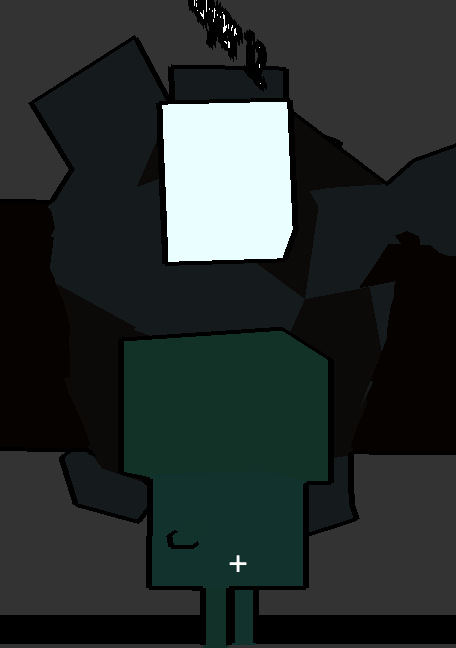
    <figcaption>
      hahhaha
    </figcaption>
  </figure>
  <figure>
    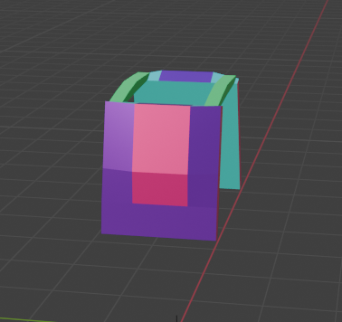
    <figcaption>
      gamer_armor
    </figcaption>
  </figure>
  <figure>
    
    <figcaption>
      mushroom_king
    </figcaption>
  </figure>
  <figure>
    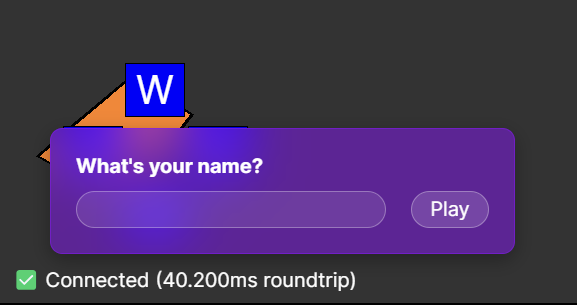
    <figcaption>
      Temporary player name prompt
    </figcaption>
  </figure>
  <figure>
    
    <figcaption>
      so maybe like this
    </figcaption>
  </figure>
  <figure>
    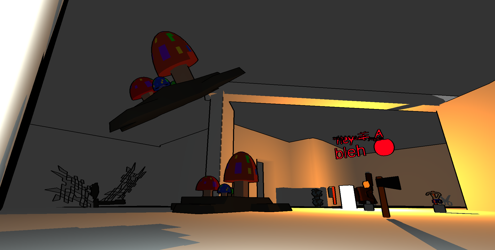
    <figcaption>
      starting the game after the first round results in two of everything which is kind of funny
    </figcaption>
  </figure>
  <figure>
    
    <figcaption>
      pile of furnaces
    </figcaption>
  </figure>
  <figure>
    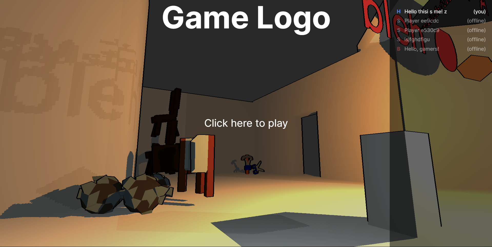
    <figcaption>
      pause menu
    </figcaption>
  </figure>
  <figure>
    
    <figcaption>
      the chair pile is growing
    </figcaption>
  </figure>
  <figure>
    
    <figcaption>
      UI with player list
    </figcaption>
  </figure>
  <figure>
    <video src="../../images/dev/reverb.mp4" controls preload="none" poster="../../images/dev/reverb-poster.png"></video>
    <figcaption>
      added reverb (caution: a bit noisy)
    </figcaption>
  </figure>
  <figure>
    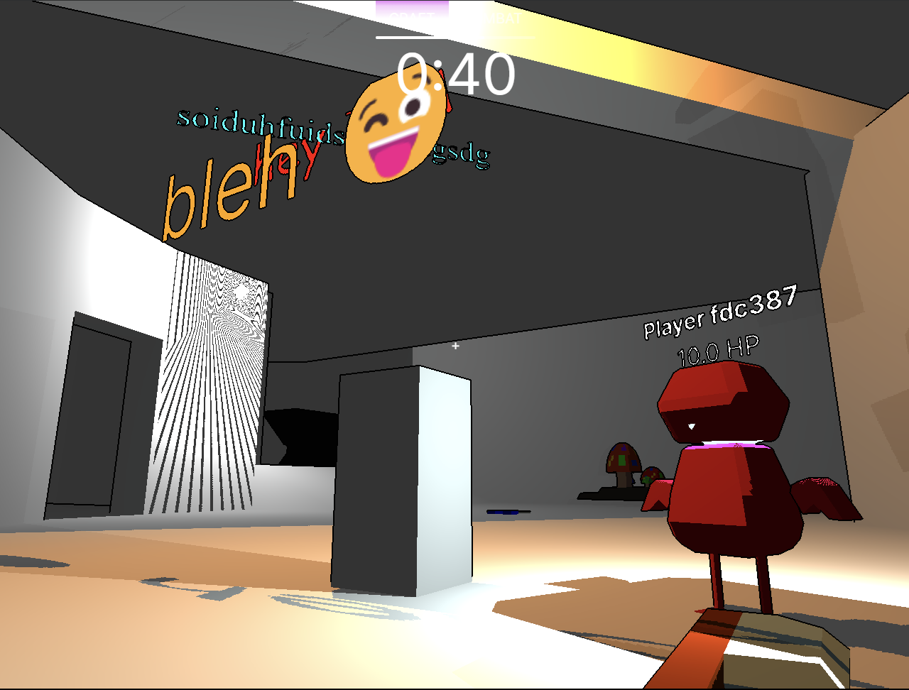
    <figcaption>
      emojis have color now
    </figcaption>
  </figure>
  <figure>
    <video src="../../images/dev/donut-health.mp4" controls preload="none" poster="../../images/dev/donut-health-poster.png"></video>
    <figcaption>
      floating donuts for health
    </figcaption>
  </figure>
  <figure>
    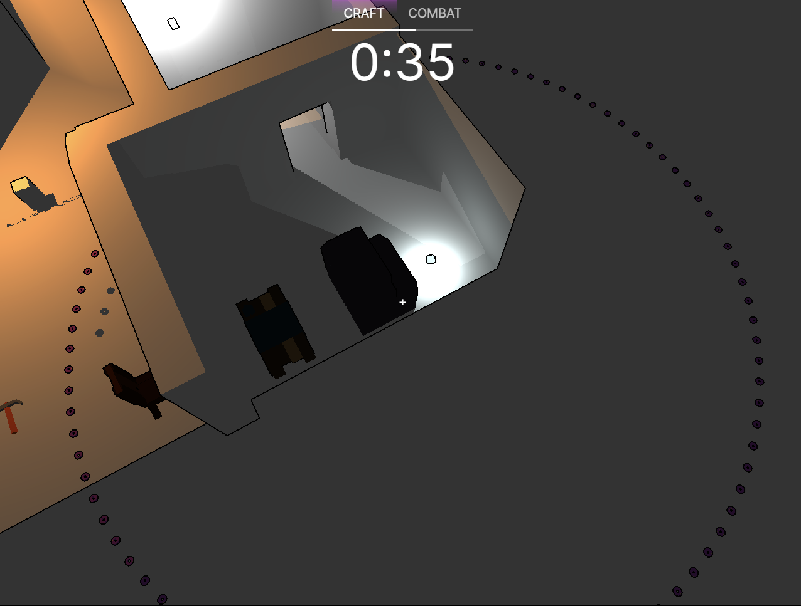
    <figcaption>
      boss health 💀
    </figcaption>
  </figure>
  <figure>
    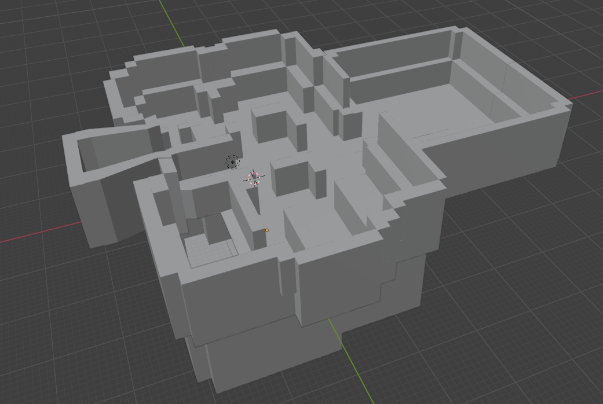
    <figcaption>
      ok wb something like this. 2 floors
    </figcaption>
  </figure>
  <figure>
    <video src="../../images/dev/particle-respawn.mp4" controls preload="none" poster="../../images/dev/particle-respawn-poster.png"></video>
    <figcaption>
      adding translucency support for the particles. they respawn every second, which results in this which is kind of amusing
    </figcaption>
  </figure>
  <figure>
    
    <figcaption>
      first floor plan for the crafting areas
    </figcaption>
  </figure>
  <figure>
    
    <figcaption>
      floor plan for second floor
    </figcaption>
  </figure>
  <figure>
    <video src="../../images/model/new-map.mp4" controls preload="none" poster="../../images/model/new-map-poster.png"></video>
    <figcaption>
      ok i think map is p much done? lmk if there are any issues
    </figcaption>
  </figure>
  <figure>
    
    <figcaption>
      maybe the floor should be a big thicker
    </figcaption>
  </figure>
  <figure>
    
    <figcaption>
      The current state of our UI.
    </figcaption>
  </figure>
  <figure>
    
    <figcaption>
      The current HUD shown during gameplay.
    </figcaption>
  </figure>
  <figure>
    <video src="../../images/dev/animation.mp4" controls preload="none" poster="../../images/dev/animation-poster.png"></video>
    <figcaption>
      i made basic animations! when you attack now it turns you into a chair, donut and a fish
    </figcaption>
  </figure>

## Group status

<!-- include both the week # and the date of the meeting -->

Meeting: [Sunday, June 2, 2024](#meeting-notes)

<!-- summarize your overall status for the week -->

<!--
nick: lobby, animation
marcelo: sounds
tyler: QoL
killian: models, final map
sean: text, ui, role selection, health
will: game stages, combat
kenzo: particles
-->

<!--
nick: posing, big boss, crystal
marcelo: sfx
tyler: unsure
killian: more models
sean: particles, show actions, mobile controls, lights
will: map collisions, easier pickup
kenzo: fix offsets
-->

This week, we created our final map and a UI that lets you select your role. There are game stages now, with combat and health for the second stage.
At this point, we will just focus on finishing major gameplay elements (e.g. the boss battle) and many quality of life issues that severely affect gameplay.

<!-- add a statement summarizing the group morale (feel free to be creative in expressing your morale) -->

<!--
nick: 10/10, tired
marcelo: panic, calm
tyler: 5/10, worried, nervous, uncomfortable
killian: nervous
sean: losing optimism
will: swell
kenzo: excited
-->

With the final presentation coming up, we're a mix of nervous and excited.

## Individual statuses

### Nick

1. My goals for this week were to make a lobby system, get animations working, and get the core game loop working with a crafting phase and a combat phase.

2. I added the setup for the lobby and am waiting on some models for the background. I still need to implement the character switcher, but that is in the works. I implemented basic model-swapping animations and an animation controller class that cycles through models to give the appearance of an animated game. Sean ended up implementing most of the game timer and win screen logic.

3. Other classes certainly are getting busy... hoo boy. There's less and less time in each day so it is definitely time to LOCK IN. Other than the impending time crunch, most things went to plan which is quite grand

4. Perhaps I could take on some of the model posing work for getting player animations for different actions if Killian doesn't have the time. I wish to make the BIG BOSS with BIG BOSS ATTACKS and BIG BOSS ANIMATIONS. and additionally if no one else does it in the meantime i wish to make the BIG CRYSTAL (now turned minecart) that has BIG HEALTH and the BIG BOSS can damage.

5. I relearned about the value of creating a new system that has very basic functionality when one is needed. It is often a lot harder to build something from scratch than to extend a system that already exists, so by starting small and getting it working with one thing, it makes it a lot easier to make it do more by leaning on that one thing you already got working. Start small, then build tall 🤓☝️

6. I am normal! 10/10 tired but wired

### Marcelo

1. what were your concrete goals for the week?

   making more sound effects

1. what goals were you able to accomplish?

   I made more sound effects and revised all previous ones. I also implemented mixing of reverb so that the sounds feel more roomie.

1. if the week went differently than you had planned, what were the reasons? note that this happens regularly…I would prefer you to be aggressive in what you want to try accomplish rather than limit yourself to goals you know you’ll easily achieve. so answering this question is more of a reflection on the development process and the surprises you encounter, it’s not at all an evaluation.

   I wanted to finish all the sound effects but im still have around 20% left to do.

1. what are your specific goals for the next week?

   finish up the game lol. specifically making more detailed sfxs such as walking and potentially scale reverb with distance.

1. what did you learn this week, if anything (and did you expect to learn it?)

   I learned how does web audio api deal with channels and mixing to help me create an effect mixing tool, it was a really cool experience.

1. what is your individual morale (which might be different from the overall group morale)?

   Panik but kalm

### Tyler

1.  what were your concrete goals for the week?

    My concrete goals for the week were to:

    1. Tuning the game to make it feel better
    2. Lock rotation so that the tools don't block your face

2.  what goals were you able to accomplish?

    I got both of those actually!

3.  if the week went differently than you had planned, what were the
    reasons? note that this happens regularly…I would prefer you to
    be aggressive in what you want to try accomplish rather than limit
    yourself to goals you know you’ll easily achieve. so answering
    this question is more of a reflection on the development process
    and the surprises you encounter, it’s not at all an evaluation.

    uhh yeah I had a small vacation to newport on this weekend, so I wasn't able to be in the meeting, and wasn't able to talk or interact regarding work, which sucks.

4.  what are your specific goals for the next week?

    I am not up to date and I don't know what needs to be done.

    I'll be talking with everyone about this tomorrow

5.  what did you learn this week, if anything (and did you expect to learn it?)

    Learned the best way for me to work with tuning the system

6.  what is your individual morale (which might be different from the
    overall group morale)?

    uhhh like a 5/10? Worried, nervous, and very uncomfortable about the work that I need to do and my ability to do it.

### Killian

1. My concrete goals for this week was to make the rest of the models we need for the game, and also make a solid version of the final map.

2. This week I was able to make a bunch more models that we need for the game and also make a new final map for the game that's more than twice as big as the tester map.

3. For this week, I met my goals but also discovered a few more models I need to make for our gameplay to work.

4. Next week, I need to make about 3 more models to complete what we need for gameplay, and then I can focus on making some illustrations for UI and such.

5. I learned a bit more about making bigger scaled and complex models with the making of the final map

6. I feel pretty good at where we're at, but a little nervous because we're approaching the deadline and I'm not sure if there wil be any problems with the map

### Sean

My goals for the past week were:

- **Options menu**: Done!
- **Timers**: Implemented by Will, but I redesigned the UI for it.
- **Sabotage selector wheel**: Not done, and I still think we should have something like this to help make the game mechanics discoverable.
- **Controls and mechanics guide**: Not done, and I haven't thought about this yet.
- **Role and skin selection screen**: Done!
- **Equip armor**: Not done, and this was brought up during our meeting again this week.

In [the past week](https://github.com/ucsd-cse125-sp24/group1/commits/main/?author=SheepTester&since=2024-05-28&until=2024-06-03), I:

- Fixed a severe graphics issue on PCs. It was because I was discarding pixels with an alpha value less than 1, which is an extremely precise cutoff. I think this issue only manifested on PCs because their graphics cards are better and have more precision, so it was possible for alpha values to be super slightly less than 1, resulting in random pixels being discarded.

- Text textures and models, so we can add labels to the world.

- UI. I decided to model our game's UI off of other web games, like [Krunker](https://krunker.io/), rather than traditional desktop apps. We won't have a menu, and instead players are just one click away from joining the game. Like Krunker, the "pause menu" (it doesn't actually pause the game) shows when the cursor is not locked, and has skin customization and options menus.

  - The UI also lets you choose between boss and hero, or spectate. While we planned the game to have 1 boss and 3 heroes, I want the game to be flexible and allow friends to play with other ratios, like 3 bosses against one hero. Currently, you can also switch roles during a game. It would be easy to prevent this, but from other games it's annoying joining a game late and having to wait for the next round. If friends don't mind deviating from the intended gameplay and allowing people to join mid-round, then we should allow that.

- I made some attempts to improve performance. Lag is still an issue sometimes, but probably not on the PCs we'll present on.

- Added support for reverb.

- During the meeting, we decided health would be a discrete value representing the number of hits the player can take before dying. I represented this in the UI and the game as floating red crystals above the head.

- Added support for translucent particles. It appears Kenzo has finished adding the ability to play particles at a location, so I want to integrate particles in more parts of the game.

I guess I did more than expected, yet the game still feels less complete than I expected. I think I will focus on further tweaks in preparation for Friday this week, since I have major assignments due daily until Thursday, and I don't anticipate doing much (or at least, I should probably focus on my other classes' final assignments first).

- Add particle effects for everything
- Have the server always check what the boss (or player in general) is looking at, and send what action it will perform if the player presses "use"
- Mobile controls
- Figure out how to integrate lights into our game
  - Talking to Nick, we could cheat by only having fixed torches in the map that can only cast shadows on non-moving entities (i.e., moving entities are ignored when creating the shadow cubemap). This seems promising, so I'll look into this.

Unlike mouse sensitivity, I do not think there is demand from within our team for custom keybinds, so I won't add it. This also allows me to assume the default keybinds when we write a help screen or make icons for attack and use.

There's still a lot that needs to be done, and we all seem to be very busy. I'm happy to see we now have an actual map, but after reflecting on the past week and the days to come, I'm losing some optimism. We will definitely have to make some concessions this week, but I still believe we'll have something playable by Friday.

### Will

1. My goal for this week was to implement game stages and some kind of win condition.

2. I set up the infrastructure for timed game stages and implemented a basic combat system in the second stage.

3. I originally planned to make a QTE for the second stage because we thought as a team that combat would take significant time to implement. But once I had the setup for stages worked out, it seemed like combat in the “physical” game space would actually be easier to do because it could build on the existing physics and interaction systems. On the other hand, to make a big QTE we would have had to make many design decisions that might have diverged from the crafting stage gameplay, e.g. how do we distribute weapons among the heroes, how do we display progress to each player in a UI, etc. Since we really wanted a big boss fight in the first place, I’m glad this path actually ended up being easier.

4. My goals for next week are to add the collision boxes for the new map and to make it easier to pick up items by adding some kind of raycast-only colliders.

5. I learned that our game is truly a platform like Professor Voelker said it would become. It’s relatively straightforward now to just add any kind of new entity, such as the ArrowEntity that I added this week and the TrapEntity that I added last week.

6. Feeling swell

### Kenzo

1. My concrete goals for this week was to make the particle systems appear when the player attacks or jumps

2. I was able to make the particles show up when the player attack or jumps but it only shows in the middle of the map

3. I am still trying to figure out how to spawn the particles in front of the players instead of the middle of the map.

4. Resetting the offsets for the bounding boxes of the objects in the map so that it is more playable and players can interact with the objects more smoothly

5. I learned how the server communicate with the client to spawn objects or play sounds in the code level.

6. So excited to see how our game will turn out!

## Meeting notes

Present: Kenzo, Will, Killian, Nick, Sean, Marcelo

- nick: number of things that could be done. nick hasnt worked on the game because unsure what to work on
- nick: we need to all develop at the same time
  - will: on the same computer, same keyboard
    - nick: designate keys. marcelo can get arrow keys
- sean: we have ui. game stages. can choose role
  - next: killian's map
- marcelo: do we have working boss battle?
  - will has combat code on a branch
    - should merge what he has
  - we are doing branching now
- will: after combat is merged, we are done. just need map
- nick: we need screen to show winner
  - sean: we have this on the lobby
  - temporary win condition is make >= 10 weapons
  - tyler was saying there was a crystal that the boss attacks, so heroes defend the crystal
  - nick: meta of the game: boss attacks crystal all the time
  - will have to talk to tyler on tuesday. but boss could win by killing crystals or all heroes
  - nick: having killing is an interesting idea. he thought of it as a party game where there's no death because you'd be sitting there
    - could respawn after 15 seconds
    - sean: could also keep combat stage short
- reminds nick of game _Oh Deer_. shittily made, but like spy party game, social deception, spy has to do something, wheels(?)
  - deer scattered around map, some real players, some fake. players have to eat mushrooms, and it shows up as a thing
  - condition: hunter has to kill all player deer. if they kill too many real deer or run out of time, then the hunter has to escape into a cabin
  - once timer hits zero, boss grows all big and the players have to use weapons, and boss can attack player. when boss small, cant do mcuh but trip players, but in combat stage, boss can smash players, heros have to smack boss
  - feasible
- sean: crafting and combat stages. combat stage should be short enough that players can permanently die. if they die, that's on them. boss should also focus on crystal instead
- nick: discretize damage on armor, as opposed to percentage. eg hit player 3x to get killed
  - if armor broken in battle, can equip real quick
  - need to scramble around find another piece of armor
  - **have armor, healing potions, damage reduction potions**
  - nick: doable. just need to lock in
  - discretization makes it visible the difference between noob and gamer armor
  - sean: could have icons floating above player. wearing armor adds more icons
  - HP bar is less party game, more dark souls
  - nick: **balloons represent health**
    - should not use balloons, would get hit by stalagtites
    - sean: crystal
  - we have armor models, but waiting on gamer model. dont think it's integrated into the game
- killian will be working on map model tomorrow. ideally by tuesday we will have it
  - sean: his models involve a lot of parts drawn one part at a time in series, not efficient. so a more complex map will be slower. need to merge
- we're not using trimeshes for physics map. boxes
  - will says it's very fast to make
- we should split up the work
  - marcelo: sfx
    - sean: upload what you have to the game
    - needs testing to make sure it sounds as intended
    - nick: **reverb**
      - sean: easy. just a convolution filter
      - we need cave
      - voices
        - sean: did want to add that, but wouldnt work for the presentation
  - when killian finishes map, update colliders
  - we need to tweak model sizing (nick can do that)
  - nick: **we need a dev room with every single item and model**
    - people love them as easter eggs
    - warren bear
  - sean: **it's hard to select items. have two shapes, one that ignores physics but raycasting hits it**
    - nick: make use of Cannon ES's collision bits
      - marcelo: we use it for collisions, jumping
        - sean: i removed it 💀, but the player still there
      - collision bits are per body, not per shape
        - but `Shape.collisionResponse`
        - look into this
  - armor system unfinished. **we need a way to equip items**
    - can slap items being held
      - use that to equip items once picked up
      - will removed it because inconvenient to hit things while holding items
      - minecraft has separate keybind for throwing items
    - picking up items is use
      - throwing a held item should be?
        - will: use same key
- nick wants model for making the dev room
  - can use default cube model
  - press key to teleport there
  - they're talking about the binding of isaac
- so nick is working on dev room. and **item offsets**?
  - we have model offsets supported
  - **someone said having both scale + offset specified breaks**
- kenzo can work on the busy work
- for health: discrete and contuous?
  - marcelo: with continuous armor, take damage, will die regardless?
    - discrete. after nth hit, can replace armor?
  - nick: big boss model comes down, hits player, player takes damage
    - assuming discrete, you have 3 health. boss hits you. you lose one health
    - marcelo gets it now
    - it's like isaac
    - oh shi, i took a damage, i will equip an armor. it gives you +2 hits you can survive. so now you have 4 things hovering above you
    - after being hit twice, can equip another piece of armor
    - have two health remaining. if boss hits you 2 more times you're dead
    - took 5 hits (2 hits of armor + 3 hits of health)
  - marcelo: continuous has no advantage of armor
  - it's a game about crafting. gives incentive for crafting more armor
  - can take infinite damage if you want
  - if we have health potions, should be continuous
    - **health potion can give you +1 health**
    - health and armor two separate things
- sean: can the boss die?
  - yes
  - sean thought the objective was to survive for the time given
  - **if boss dies -> heroes win**
  - we want combat stage short so we dont have to worry about players being dead for too long
    - so surviving makes sense. Minecraft warden makes sense
  - each boss attack should be strong
  - how to prevent boss walking to the crystal
  - nick's vision doesn't have a crystal
    - we should tell Killian ASAP if so
    - will: crystal makes it concept
  - filter on screen that makes corners red
    - red vignette
    - could use HTML
    - could use render pipeline
    - **when you get hit. need a lot of visual feedback for getting hit**
      - camera shake
      - as impactful as possible
  - **when boss is big and it moves, shake screen. when boss is closer, client shakes more**
    - shaking is a filter
- so do we have a crystal?
  - could make sense, but we need to formulate what weapons do
  - if can kill boss, then boss
- 3 outcomes for crystal:
  - players try kill boss, boss try kill crystal. if boss trying to kill crystal, can't kill players. boss wants to kill them both
    - marcelo: seems complicated
    - boss has two conflicting goals
    - crystal doesnt add anything new
  - boss can realize kill players first
  - players can do hide and seek
    - there's a lower level
  - crystal forces players to show themselves
  - boss could lose if players go hide
  - boss has meta goal to kill crystal, but not optimal. optimal for boss to kill players.
    - win condition: destroy players or destroy crystal
    - goal of destroy crystal is to make players attack boss
  - marcelo: we just made league of legends
- how to make boss focus on players over crystals
  - boss wont do much damage to crystal. maybe requires a minute of sitting therc
  - will: destroying crystal wont be that hard, but focusing on it will kill boss
  - marcelo: balancing is a later goal
  - inferno damage on the crystal, keep attacking crystal to do more damage, but incentivizes killing the crystal. boss should focus on destroying the players, then destroy crystal if players hiding
  - boss isn't constricted by time. the heroes are
- what if crystal was a crystal drill that the players used to get into the mine
  - for lore
  - explains how players can escape
  - crystal is an escape hatch
- we could have items that can be crafted, and make crystal some absorber of items where players can throw items into it
  - this is a different game
- **lore: narration during crafting stage**
  - "Miners realized that the cave was too small. So they ahd to mjien . But oh no the boss. 10000 kills. galvanized square steel . escape the kids"
- keep it the same, but **change the crystal into a ship that the players can use to escape**
  - because would expect boss to protect crystal
- marcelo: during crafting stage, no crystal. but stealing energy from cave, forming a crystal. so boss is trying to restore energy back to the cave
  - nick: would be hard to convey in the map
  - good crystal lore
- need to finalize this ASAP for Killian
- **boss can die. so it needs health**
  - 30 hits per player, 100 total (ballpark)
    - with gamer swords
    - assuming all 3 heroes have gamer swords
    - the thought behind gamer stuff is that few players will have gamer stuff
  - boss can't heal
  - if can attack every second or 0.5 seconds, should take 30 seconds of spam clicking to take down boss
    - or 20 seconds, or lower
    - hate Minecraft PVP tho
    - boss should be able to withstand 20 seconds of players modding
- for boss smacking, does it have an attack area
  - spore bomb?
  - neat: **bomb that explodes after a few seconds.** after # of ticks, a sphere collider spawns in, and if you're inside it then you're launched in opposite direction and take damage
  - for MVP attack, should it reequire selecting a player
  - **a rectangle in front of a boss. box collider that can hit a player. if hit by boss attack**
  - one attack per 2-3 seconds
  - the box can go through walls?
    - nick: yes?
  - animations?
    - no. just particles and effects
  - nick: would be doable to get animations working by model swapping
    - good MVP
    - **one animation for boss at MVP. swap between models**
- nick: **spore should knock you back**

todo summary:

- sound effects (marcelo)
- reverb (sean or marcelo)
- finished map (killian)
  - update colliders (will)
- health system (sean)
- boss attack
- boss animation
- equipping armor
- dev room with all items (nick)
- adjust item collider sizing/offset (kenzo)
- separate colliders for selecting items (will)
